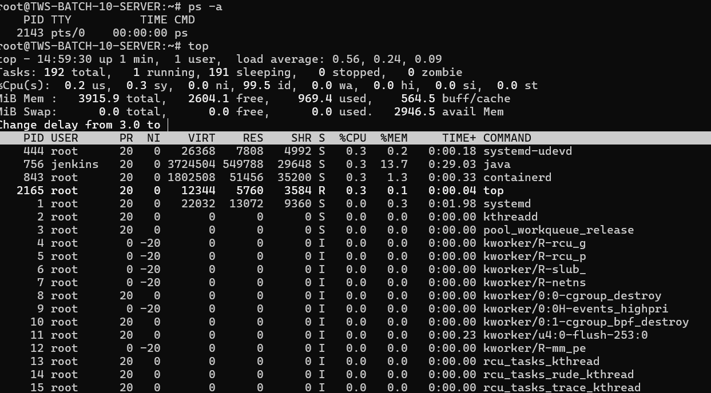
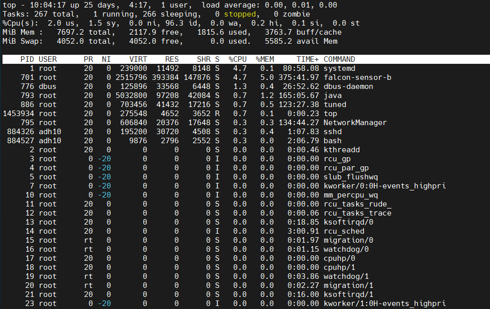
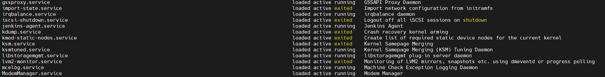
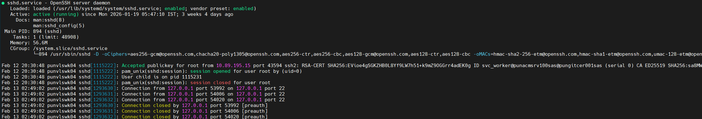
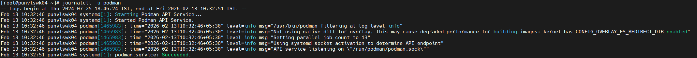
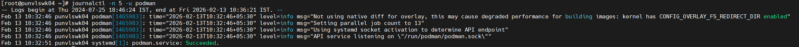
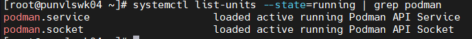
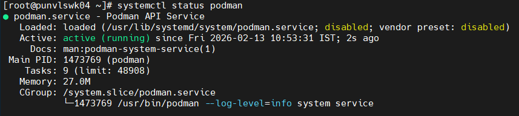
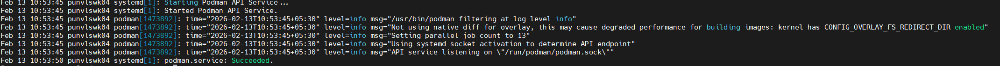

## Process commands

- ps aux

- top

## Service commands

- systemctl list-units
Lists all services present in the machine

- systemctl status sshd

## Log commands

- journalctl -u podman

- journalctl -n 5 -u podman
Displays the latest 5 lines of logs of a service

## Inspect one service - Podman

- systemctl list-units --state=running | grep podman
To check if podman is running

- systemctl status podman
This commands tells the exact status of podman

- journalctl -u podman
Displays detailed log

