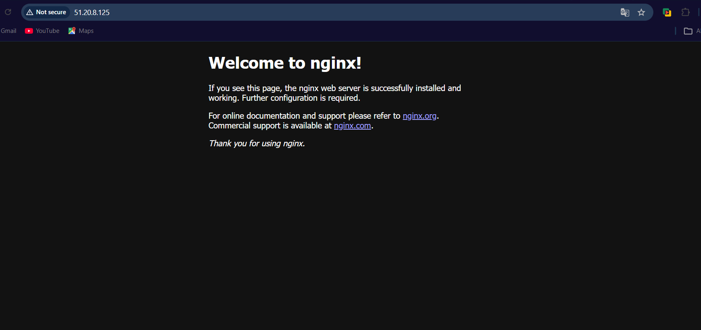

# Day 08 – Cloud Server Setup: Docker, Nginx & Web Deployment
 ## Install Docker & Nginx
 - Update system - `sudo apt update && sudo apt upgrade -y`
 - Install Nginx - `sudo apt install nginx -y`
 - Check Nginx status - `systemctl status nginx`
 - check Nginx Logs - `journalctl -u nginx -n 50`
 - Security Group Configuration - Opened port 80 (HTTP) in Security Group, allowed inbound traffic from 0.0.0.0/0 for testing.
 - Test Web Access - http://your-instance-ip - Successfully saw the Nginx Welcome Page
 
 - Extract Nginx Logs - `ls -l /var/log/nginx` , `cat /var/log/nginx/access.log`
 - Create the file & Save Logs to File - `touch nginx-logs.txt` `sudo cp /var/log/nginx/access.log nginx-logs.txt`
 - Then fix ownership: `sudo chown ubuntu:ubuntu nginx-logs.txt`
 - Confirm File Exists - `ls -l nginx-logs.txt` & exit server
 - On local Download It - `scp -i linux_tasks.pem ubuntu@ec2-51-20-8-125.eu-north-1.compute.amazonaws.com:~/nginx-logs.txt .`
 - Check the logs - `cat nginx-logs.txt` - the logs of nginx will show here
 # ⚠️ Challenges Faced

 - ❌ Tried installing docker instead of docker.io (wrong package name).
 - ❌ SCP failed because file did not exist in the home directory.
 - ❌ Permission denied while copying logs from /var/log/nginx/.
 - ❌ Initially ran scp from inside EC2 instead of local machine.

 # ✅ How I Solved Them
 - Verified correct package names using apt search.
 - Confirmed file existence using ls -l.
 - Used sudo cp and chown to fix permissions.
 - Understood that scp must be run from the local machine to download files.

 # 📚 What I Learned
 - The importance of verifying file paths before using scp.
 - How Linux file ownership (chown) affects access and downloads.
 - Default Nginx log locations (/var/log/nginx/access.log, error.log).
 - Difference between running commands locally vs remotely.
 - Real-world troubleshooting mindset: verify → fix → test → validate.

