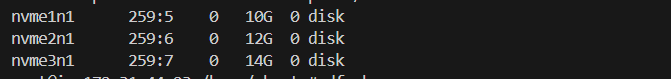
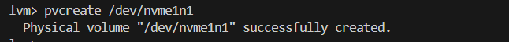
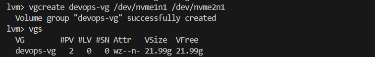
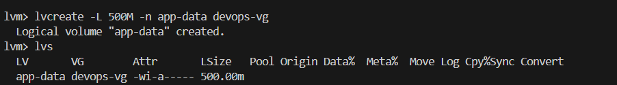
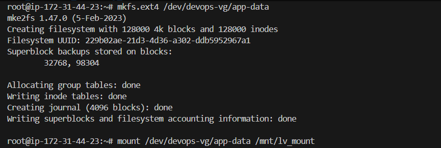
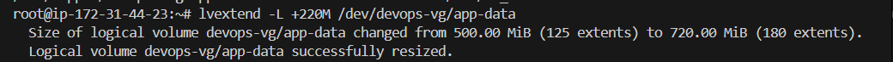
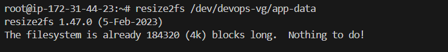
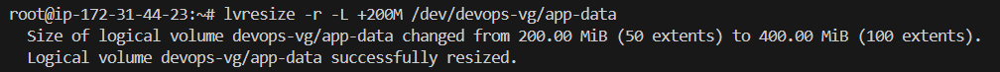

# Day 13 – Linux Volume Management (LVM)
## Commands Used
- `sudo su` / `sudo -i`
- `lsblk` (list all blocks)

*After Attaching volumes(ESB)*

---

- `pvcreate` / `pvs`

*After creating pysical volume*

---
- `vgcreate` / `vgs`

*Creating volume group using two physical volume nvme1n1 and nvme2n1*

---

- `lvcreate` / `lvs`

*Creating Logical volume ussing volume group*

---

- `mkfs.ext4 <source>`
- `mount <source> <destination>`

*After mounting logical volume*

---

- `lvextend -L +300M /dev/aws_vg/aws_lv` **OR** `lvresize -L +300M /dev/aws_vg/aws_lv`

*extend 220 M.B. size on logical volume*

**Logical Volume is 772MB But Filesystem size is still 452MB(You must resize the filesystem manually).**

---

- `resize2fs /dev/aws_vg/aws_lv` 

*verify*

   
---

- `lvresize -r -L +200M /dev/aws_vg/aws_lv`

r = resize the filesystem

*verify*

---

# What I Learned
LVM Architecture Hierarchy
- Physical Volumes (PV)
- Volume Groups (VG)
- Logical Volumes (LV)