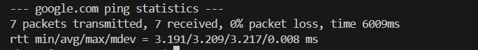
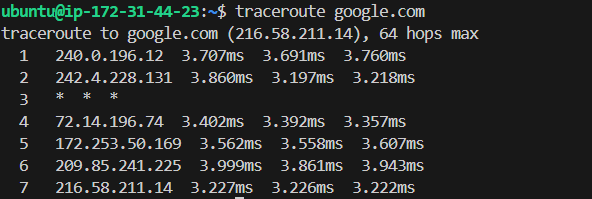

# OSI Model (L1–L7) vs TCP/IP Stack
## OSI Model (7 Layers)
- A conceptual framework with 7 layers (Physical → Application) to understand how data moves through a network.
- Mainly used for learning and troubleshooting.
## TCP/IP Model (4 Layers)
- Practical model used in real-world networking (Link, Internet, Transport, Application).
-  Simpler and aligns with how the internet actually works.

# Where Protocols Sit in the Stack
- IP → Internet Layer (Handles addressing & routing)
- TCP/UDP → Transport Layer (Handles data delivery & ports)
- HTTP/HTTPS → Application Layer (Used for web communication)
- DNS → Application Layer (Resolves domain names to IP addresses)

# Real Example
## curl https://example.com
- Application Layer → HTTPS
- Transport Layer → TCP
- Internet Layer → IP
- So it works as: Application (HTTPS) → TCP → IP → Network

# 🌐 Networking Hands-On Checklist
## 1️⃣ Identity
- `hostname -I` - Server IP is 172.31.44.23 (private IP inside cloud network). Confirms instance network configuration.
## 2️⃣ Reachability
- `ping google.com` - Average latency ~20–30 ms, 0% packet loss. Indicates stable internet connectivity. ping checks whether another device/server is reachable over the network and measures how long it takes to respond. It asks: “Are you there?” and measures how fast the reply comes back.

## 3️⃣ Path Check
- `traceroute google.com` OR `tracepath google.com` - Multiple hops across ISP backbone. No major timeouts. One hop showed slightly higher latency (~80 ms). So it shows the path (hops) your network traffic takes to reach a destination server. It tells you how your data travels across the internet — step by step.

## 4️⃣ Open Ports
- `ss -tulpn` - Found SSH service listening on port 22 (sshd). Confirms remote access is active. So basically it Shows all TCP and UDP services that are currently listening, and tells which process is using them.”
## 5️⃣ Name Resolution
- `dig google.com` - Domain resolved to IP 142.250.x.x. Confirms DNS resolution working properly. dig stands for Domain Information Groper. It is used to query DNS servers and check how a domain name resolves to an IP address. In simple words - dig asks: “What is the IP address for this domain?”
## 6️⃣ HTTP Check
- `curl -I https://google.com` - Received HTTP/1.1 200 OK (or 301 redirect). Confirms application layer communication works.
## 7️⃣ Connection Snapshot
- `netstat -an | head` - Multiple LISTEN states (port 22). Few ESTABLISHED connections (active SSH session). netstat (network statistics) is a command used to display network connections, routing tables, interface statistics, and open ports on a system.

# 🔎 Mini Task: Port Probe & Interpret
## 🔹 Step 1: Identify a Listening Port
- `ss -tulnp` - SSH running on port 22
```
tcp   LISTEN   0   128   0.0.0.0:22   0.0.0.0:*   users:(("sshd",pid=1234))
```
## 🔹 Step 2: Test From Same Machine
- `nc -zv localhost 22`One line interpretaion -  Port 22 is reachable; SSH service is running and accepting connections. 
- Here `nc` stands for Netcat used to check is a port is open and reachable. `-z` means zero I/O mode , it checks if the port is open without sending any data. It just check the connection. `-v` is Verbose mode means it shows details output, without -v the output would be minimal
## If port 22 not reachable than we can check:
- if the service is running? - `systemctl status ssh`
- is firewall blocking the port? - `sudo ufw status`
- In short port 22 is reachable on localhost; if not, I would check service status and firewall rules. `UFW` stands for Uncomplicated Firewall. UFW controls which ports are allowed or blocked on your server.