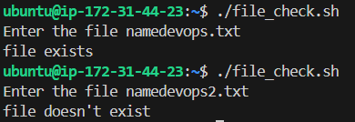
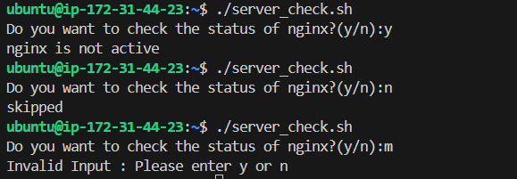

## Day 16 – Shell Scripting Basics
# Task 1: Your First Script
- Create a file hello.sh - `vim hello.sh`
- Add the shebang line #!/bin/bash at the top - `#!/bin/bash`
- Print Hello, DevOps! using echo - `echo "Hello, devops!"`
- Make it executable and run it - `chmod 755 hello.sh` , `./hello.sh` -> O/P - Hello, Devops!

# Task 2: Variables
- Create variables.sh - `vim variable.sh`
- A variable for your NAME - `name="Apurva"`
- A variable for your ROLE (e.g., "DevOps Engineer") - `role="Devops engineer"`
- Print: Hello, I am <NAME> and I am a <ROLE> - `echo "I am $name and I am $role"`

# Task 3: User Input with read
- Create greet.sh - `vim greet.sh`
- Asks the user for their name using read - `read -p "What is your username" name`
- Asks for their favourite tool - `read -p "what is your fav tool?" tool`
- Prints: Hello <name>, your favourite tool is <tool> - `echo "your username is $name & your fav tool is $tool"`

# Task 4: If-Else Conditions
- Create check_number.sh - `vim check_umber.sh`
- Takes a number using read - `read -p "Enter the number" number`
- Prints whether it is positive, negative, or zero -
```
read -p "Enter a number: " number

if ! [[ "$number" =~ ^-?[0-9]+$ ]]; then
    echo "Invalid input. Please enter a valid integer."
elif [ "$number" -gt 0 ]; then
    echo "Positive number."
elif [ "$number" -lt 0 ]; then
    echo "Negative number."
else
    echo "Zero."
fi
```
- Create file_check.sh - `vim file_check.sh`
- Checks if the file exists using -f
```
#!/bin/bash

read -p "Enter file name: " file

if [ -f "$file" ]; then
    echo "File exists."
else
    echo "File does not exist."
fi
```
- Prints appropriate message


# Task 5: Combine It All
- Stores a service name in a variable (e.g., nginx, sshd) - `service="nginx"`
- Asks the user: "Do you want to check the status? (y/n)" - `read -p "Do you want to check the status of $service?(y/n)" choice`
- If y — runs systemctl status <service> and prints whether it's active or not, If n — prints "Skipped."
```
#!/bin/bash

# Store service name
service="nginx"

# Ask user
read -p "Do you want to check the status of $service? (y/n): " choice

if [ "$choice" = "y" ]; then
    # Check if service is active
    if systemctl is-active --quiet "$service"; then
        echo "$service is ACTIVE."
    else
        echo "$service is NOT ACTIVE."
    fi
elif [ "$choice" = "n" ]; then
    echo "Skipped."
else
    echo "Invalid input. Please enter y or n."
fi
```


## Key Learning
- Learned the importance of the shebang (#!/bin/bash), execution permissions, and how the shell processes scripts step by step.

- Practiced using variables, echo, and read, and understood the difference between single vs double quotes for variable expansion.

- Implemented conditional logic (if-else), file checks (-f), and service status validation using systemctl to build real-world automation scripts.
