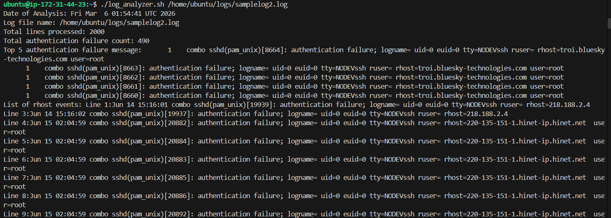

## Task 1: Input and Validation
```
#!/bin/bash

log_file=$1

if [ $# -ne 1 ]; then
        echo "Usage: ./log_analyzer.sh <path to a log file>"
        exit 1
elif [ ! -f "log_file" ]; then
        echo "Log file doesn't exist"
        exit 1
fi
```
## Task 2: Error Count
```
# Count the total number of lines in the log file
total_lines_count=$(wc -l < "$log_file")

# Count the number of error messages
error_message_count=$( grep -c "ERROR" "$log_file")
```
## Task 3: Critical Events
```
#Search for lines containing the keyword CRITICAL with line numbers
critical_event=$(grep -n "CRITICAL" "$log_file" | sed 's/^\([0-9]*\):/Line \1:/')
```
## Task 4: Top Error Messages
```
top_error=$( grep "ERROR" "$log_file" | awk '{$1=$2=$3=""; print}' | sort | uniq -c | sort -rn | head -5)
```
## Task 5: Summary Report
```
summary_report="log_report_$(date +%Y-%m-%s).txt"

{
        echo "Date of Analysis: $(date)"
        echo "Log file name: $log_file"
        echo "Total lines processed: $total_lines_count"
        echo "Total error count: $error_message_count"
        echo "Top 5 error message: $top_error"
        echo "List of critical events: $critical_event"

} | tee "$summary_report"

echo "Summary report generated: $summary_report"
```
## Task 6 (Optional): Archive Processed Logs
```
# Create an archive/ directory if it doesn't exist                                                                                                               
archive_dir="./archive_dir"
                                                                                                                                                                 
if [ ! -d "$archive_dir" ]; then
        mkdir "$archive_dir"
fi
                                                                                                                                                                 
# Move the processed log file into archive/ after analysis                                                                                                       
mv "$log_file" "$archive_dir/"
                                                                                                                                                                 
# Print a confirmation message                                                                                                                                   
echo "$log_file" moved to "$archive_dir"
                                                                                                                                                                 
echo "Log analysis completed"
```
# OUTPUT

