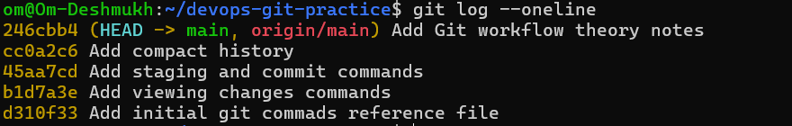

1. What is the difference between git add and git commit?

A. git add stages a modified file or folder where as git commit permanently creates a snapshot of the local repository

2. What does staging area do? Why doesn't git just commit directly?

A. Staging area helps in reverifying your changes if you want to finally commit to repository or unstage and do some more changes or do not commit at all.

3. What information does git log show you?

A. git log shows detailed information of what are the earlier commits done to repository. It contains information of author(username and user email), commit id, commit message, date and time of commit.

4. What is .git/ folder and what happens if you delete it?

A. .git/ contains all the metadata and object data used to maintain project's version history. If we delete the folder then the folder will not be considered as git repository.

5. What is the difference between a working directory, staging area and repository?

A. Working directory is where you keep doing your required changes. Staging area where you add your changes to finalize them to send to repository. Repository is where the files and folders stays with expected changes.

## git log --oneline

