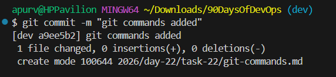
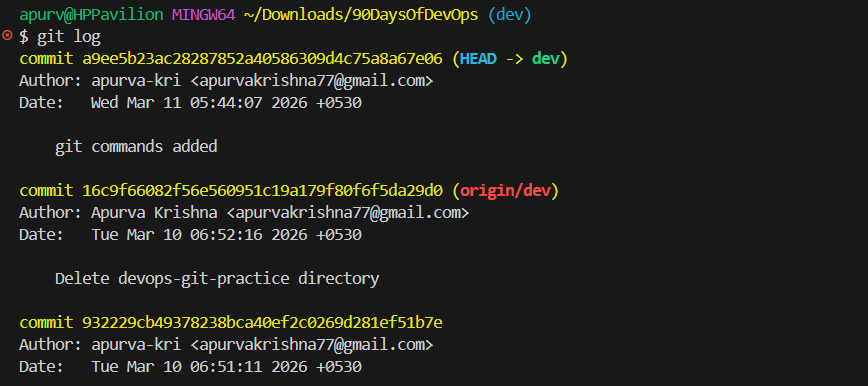
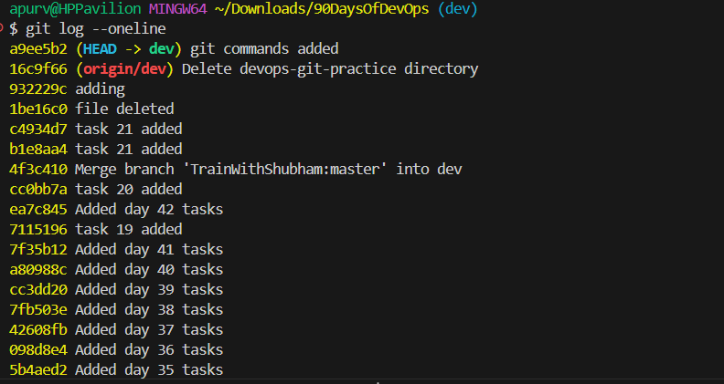

## Day 22 – Introduction to Git: My First Repository
# Task 1: Install and Configure Git

# Task 2: Create Your Git Project

# Task 3: Create Your Git Commands Reference
# Git Commands Reference

## Setup & Config

### git --version
- Shows the installed Git version.
```
git --version
```
Sets your global Git username.
- git config --global user.name
```
git config --global user.name "Rahul Sharma"
```
- git config --global user.email
- Sets your global Git email address.
```
git config --global user.email "rahul@gmail.com"
```
- git config --list
- Displays all Git configuration settings.
```
git config --list
```
# Basic Workflow

- git init , Initializes a new Git repository.
```
git init
```
# mkdir , Creates a new directory.
```
mkdir devops-git-practice
```
# cd , Changes the current directory.
```
cd devops-git-practice
```
# touch , Creates a new file.
```
touch git-commands.md
```
# Viewing Changes - git status
- Shows the current status of the repository including tracked and untracked files.
```
git status
```
# Task 4: Stage and Commit- Staging & Committing

# git add - Adds files to the staging area.
```
git add git-commands.md
```
# git commit -m , Saves staged changes with a message.
```
git commit -m "Add git commands reference documentation"
```

# git log - Displays commit history.
```
git log
```

# git log --oneline - Shows a compact version of commit history.
```
git log --oneline
```


# Visual Git Workflow (Very Important)
```
Working Directory
        │
        │ git add
        ▼
Staging Area
        │
        │ git commit
        ▼
Git Repository (History)
```
## Branching
# git branch - Shows all branches in the repository.
```
git branch
```
# git checkout - Switches to another branch.
```
git checkout main
```