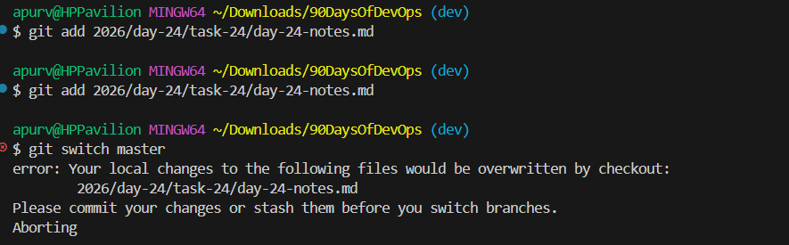

## Day 24 – Advanced Git: Merge, Rebase, Stash & Cherry Pick
# Task 1: Git Merge — Hands-On
- 1 - Create a new branch feature-login from main, add a couple of commits to it
- git switch -c feature-login - create a branch feature-login as well as switch to the same branch
- Add two commits to feature-login branch and merge it to master- it will get fast forwrd merge because main had no new commits after the branch was created. Git simply moves the main pointer forward.
```
A --- B --- C
main
feature-login
```
- 2: Now create another branch feature-signup, add commits to it — but also add a commit to main before merging
Merge commit created, because both branches now have different histories.
```
A --- D -------- M
       \        /
        B ---- C
```
Here M = merge commit
## What is a fast-forward merge?
- A fast-forward merge happens when the target branch has no new commits since the feature branch was created. Git simply moves the branch pointer forward instead of creating a new merge commit.
```
Example:
main: A
feature: A --- B --- C
After merge:
main: A --- B --- C
```
## When does Git create a Merge Commit?
- Git creates a merge commit when both branches have new commits and their histories have diverged.
Example:
```
main: A --- D
        \
feature: B --- C
```
After merge:
```
A --- D ------ M
       \      /
        B --- C
```
M is the merge commit.
## What is a Merge Conflict?
- A merge conflict occurs when Git cannot automatically combine changes from two branches. This usually happens when:
The same line of code is edited in both branches
The same file is modified differently
Binary files (images, etc.) are changed in both branches
Example conflict scenario: Changes in same file and line
```
main branch:     Hello World
feature branch:  Hello Git
```
Git cannot decide which one to keep, so it asks the user to resolve the conflict manually.
```
✅ Short summary
Situation	Result
Main has no new commits - 	Fast-forward merge
Both branches changed - 	Merge commit
Same line edited in both branches -	Merge conflict 
```
## Task 2: Git Rebase — Hands-On
- Create a branch feature-dashboard from main, add 2-3 commits -> ```git switch -c feature-dashboard```
- While on main, add a new commit (so main moves ahead)
- What does rebase actually do to your commits?
- Rebase moves your branch commits and reapplies them on top of another branch. It rewrites commit history by creating new commits.
```
Before rebase:
main: A --- E
feature: B --- C --- D

After rebase:
A --- E --- B' --- C' --- D'
```
## How is the history different from a merge?
- Merge keeps branch history and creates a merge commit.   
```
A --- E ---- M
       \    /
        B--C--D
```
- Rebase replays commits and creates a linear history.
```
A --- E --- B' --- C' --- D'
```
So the history looks cleaner and easier to read.
## Why should you never rebase commits that have been pushed and shared?
- Because rebase rewrites commit history. If commits were already pushed:
- Other developers may already have those commits.
- Rewriting them causes history conflicts.
- It can break the repository for others.
- Rule:
❗ Never rebase public/shared branches.

## When would you use rebase vs merge?
- Use Rebase -> Clean up local commits , Update feature branch with latest main, Maintain linear history, Before creating pull request
```
So Rebase is, reapplies commits from one branch onto another branch to create a linear history.
```
- use Merge -> Combine branches safely , When branch is shared, Preserve full branch history , Team collaboration
```
Merge is, combines histories of two branches by creating a merge commit.
```
## Task 3: Squash Commit vs Merge Commit
- What does squash merging do?
- Squash merging combines multiple commits from a feature branch into a single commit before adding it to the main branch. This creates a clean and simple commit history. Command - ``` git merge --squash feature-profile```
## When would you use squash merge vs regular merge?
Use squash merge when: There are many small commits, Commit history is messy & You want a clean history
Use regular merge when: You want to preserve complete commit history, Working with a team & Important commits should stay visible
## What is the trade-off of squashing?
- The trade-off is that you lose the detailed commit history of the feature branch. This means you cannot easily see:
individual fixes
step-by-step changes
who made specific small changes
Simple Visual Summary
SQUASH
```
A --- S
```
MERGE
```
A --- M
     / \
    B   C
```
## Task 4: Git Stash — Hands-On
- Start making changes to a file but do not commit, Now imagine you need to urgently switch to another branch — try switching. What happens? You will get the message that stash the items before you switch

## What is the difference between git stash pop and git stash apply?
- git stash pop -> Applies the stash and removes it from the stash list
- git stash apply -> Applies the stash but keeps it in the stash list

## When would you use stash in a real-world workflow?
- Developers use git stash when:
They are in the middle of work
They need to quickly switch branches
They are not ready to commit changes

- Example situations:
Urgent bug fix on another branch
Pulling latest changes
Testing something quickly
Stash temporarily saves unfinished work without committing it.

## Useful stash commands
- git stash -> save changes
- git stash list -> view stashes
- git stash pop -> apply + remove stash
- git stash apply -> apply stash only
- git stash drop stash@{0} -> delete stash
- git stash clear -> delete all stashes