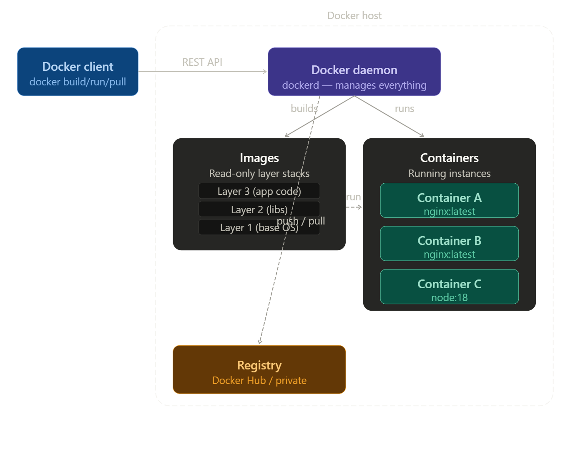
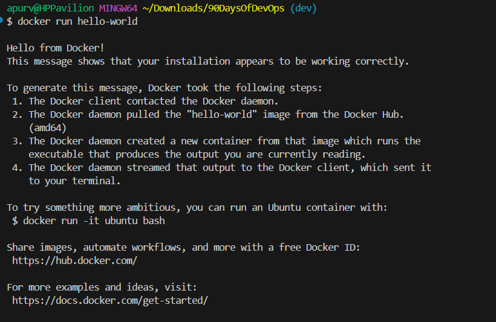
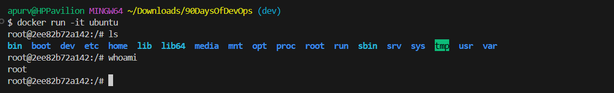
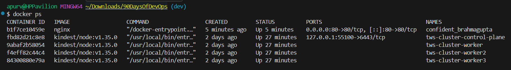
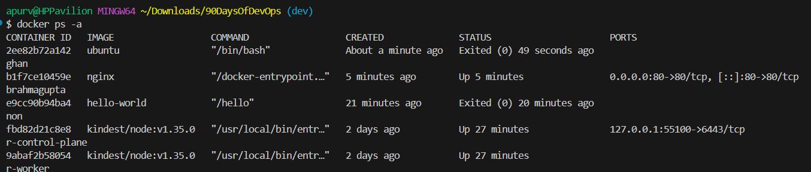

# Day 29 – Introduction to Docker
## Task 1: What is Docker?
- Docker is a platform for containerization — a way to package software so it runs consistently across different environments.
- Instead of saying "it works on my machine," Docker lets you bundle your application along with everything it needs (code, runtime, libraries, config) into a single unit called a container. That container runs the same way everywhere — on your laptop, a colleague's machine, or a cloud server.

## What is a Container & Why Do We Need Them?
- A container is a lightweight, standalone, executable package that includes everything needed to run a piece of software:
1. Application code
2. Runtime (e.g., Node.js, Python)
3. Libraries & dependencies
4. Configuration files

- Think of it like a shipping container in the real world — it boxes up your "cargo" (app) in a standard format that can be loaded onto any "ship" (server) without worrying about what's inside or how it was built.
- A container freezes the environment your app needs and carries it everywhere.
```
[ Your App Code          ]
[ Runtime (Python 3.11)  ]   ← All bundled together
[ Libraries & Deps       ]      in one container
[ Config & Env Variables ]
```
-Now it runs identically on every machine that has Docker installed — no setup, no conflicts.

## Containers vs Virtual Machines — what's the real difference?
### How a Virtual Machine Works
- A VM simulates an entire physical computer — including its own OS, kernel, drivers, and hardware. Each VM carries a full operating system (GBs of overhead) and runs on a hypervisor (e.g., VMware, VirtualBox, Hyper-V) that emulates hardware.
```
┌──────────────────────────────────────┐
│           Your Host Machine          │
│                                      │
│  ┌─────────┐  ┌─────────┐           │
│  │   VM 1  │  │   VM 2  │           │
│  │─────────│  │─────────│           │
│  │  App A  │  │  App B  │           │
│  │ Libs/   │  │ Libs/   │           │
│  │  Deps   │  │  Deps   │           │
│  │ Guest   │  │ Guest   │           │
│  │  OS     │  │  OS     │           │
│  └────┬────┘  └────┬────┘           │
│       └──────┬─────┘                │
│         Hypervisor                  │
│           Host OS                   │
│           Hardware                  │
└──────────────────────────────────────┘
```
### How a Container Works
- Containers share the host OS kernel and only bundle the app + its dependencies — nothing more. No duplicate OS. No hypervisor. Just isolated processes running on the same kernel.
```
┌──────────────────────────────────────┐
│           Your Host Machine          │
│                                      │
│  ┌─────────┐  ┌─────────┐           │
│  │  Cont 1 │  │  Cont 2 │           │
│  │─────────│  │─────────│           │
│  │  App A  │  │  App B  │           │
│  │ Libs/   │  │ Libs/   │           │
│  │  Deps   │  │  Deps   │           │
│  └────┬────┘  └────┬────┘           │
│       └──────┬─────┘                │
│       Container Runtime             │
│   Host OS Kernel (SHARED)           │
│           Hardware                  │
└──────────────────────────────────────┘
```
### Side-by-Side Comparison
 
| Feature | Virtual Machine | Container |
|---|---|---|
| **Size** | GBs (full OS inside) | MBs (just app + libs) |
| **Boot Time** | Minutes | Milliseconds – Seconds |
| **OS** | Full guest OS per VM | Shares host OS kernel |
| **Isolation** | Strong (hardware-level) | Good (process-level) |
| **Performance** | Slower (emulation overhead) | Near-native speed |
| **Portability** | Heavier, harder to move | Lightweight, runs anywhere |
| **Density** | ~10s per host | ~100s per host |
| **Security** | Very strong boundary | Strong, but shared kernel |
| **Use Case** | Full OS isolation needed | App packaging & scaling |

## What is the Docker architecture? (daemon, client, images, containers, registry) Draw or describe the Docker architecture in your own words.
- The Docker client is what you interact with directly — when you run docker build or docker run in your terminal, that's the client sending instructions.
- The Docker daemon (dockerd) is the background process that does the actual work — building images, running containers, managing networks and volumes. The client talks to it over a REST API.
- Images are read-only blueprints. They're built in layers (each RUN, COPY, or FROM in a Dockerfile adds a layer), and layers are cached and reused across images to save space.
- Containers are running instances of images — isolated processes on your machine. You can run many containers from the same image simultaneously.
- The registry (Docker Hub by default) is the remote store where images live. When you docker pull, the daemon fetches an image from the registry. When you docker push, you upload one.


### Here's how the pieces connect in plain terms:
- You type docker run nginx in your terminal (the client)
- The client sends that instruction to the daemon over a REST API
- The daemon checks if the nginx image exists locally — if not, it pulls it from the registry
- The image is a stack of read-only layers (base OS → libs → app)
- The daemon spins up a container — a live, writable process built on top of that image
- Multiple containers can run from the same image simultaneously, each fully isolated
The daemon is the brain of the whole operation — the client is just how you talk to it.

## Task 2: Install Docker
- Install Docker on your machine (or use a cloud instance), Verify the installation & Run the hello-world container
- Verify the docker - ```docker --version``` OR ```docker info```

- ```docker run hello-world``` - O/P below:-


- What just happened — explained
1. Step 1 — Client talked to daemon ```The Docker client contacted the Docker daemon.```
Your ```docker run hello-world``` command in Git Bash (client) sent the instruction to Docker Desktop running in the background (daemon).

2. Step 2 — Image pulled from Docker Hub - ```The Docker daemon pulled the "hello-world" image from Docker Hub. (amd64)```
The daemon checked your machine — no ```hello-world``` image found locally. So it went to Docker Hub and downloaded it. ```amd64``` means it pulled the version matching your laptop's processor architecture (Intel/AMD 64-bit).

3. Step 3 — Container created and run- ```The Docker daemon created a new container from that image which runs the executable that produces the output you are currently reading.```
The daemon took the image, spun up a container from it, and that container ran a tiny program whose only job was to print this message.

4. Step 4 — Output streamed back to you - ```The Docker daemon streamed that output to the Docker client, which sent it to your terminal.``` 
The container's output travelled from daemon → client → your Git Bash screen.

## Task 3: Run Real Containers
1. Run an Nginx container and access it in your browser
```docker run -d -p 80:80 nginx```

2. Run an Ubuntu container in interactive mode — explore it like a mini Linux machine
```docker run -it ubuntu```


3. List all running containers
```docker ps```

Note: Here Ubuntu will not show because e exited it and its stopped

4. List all containers (including stopped ones)
```docker ps -a```
It will show all the containers including the stopped ones.


5. Stop and remove a container
```docker stop 2ee82b72a142```
Here 2ee82b72a142 is a container ID.
```docker rm 2ee82b72a142```

## Task 4: Explore
1. Run a container in detached mode — what's different?
- There are two ways to run a container — attached and detached.
- With attached mode`without -d` your terminal gets **blocked**. Nginx output streams directly to your screen. You can't type any other commands. To stop it you have to press `Ctrl+C`.
- However, with detached mode Docker starts the container in the **background** and immediately gives you back your terminal. It just prints the container ID and you're free to run more commands.

2. Give a container a custom name
```docker run -d -p 8080:80 --name my-nginx nginx```
- Without --name, Docker assigns a random name like quirky_hopper or sad_einstein. That's fine for experiments but annoying when you want to stop, inspect, or remove a specific container.
- Naming rules
Lowercase letters, numbers, hyphens, underscores
Must be unique — two running containers can't share the same name
```
# Good names
--name my-nginx
--name web-server
--name app_v2
```
3. Map a port from the container to your host
- This is the `-p` flag — one of the most important Docker concepts. A container runs in its own isolated network. Even if nginx is listening on port 80 inside the container, your browser on your laptop **cannot reach it** — because the container's network is invisible to the outside by default.
Syntax - -p <host-port>:<container-port>
```
# Your laptop's 8080 → container's 80
docker run -d -p 8080:80 nginx
# Access at http://localhost:8080
```

4. Check logs of a running container
```docker logs b1f7ce10459e``` OR ```docker logs my-nginx``` Here my-nginx is a container custom name we can use container ID or name both.

5. Run a command inside a running container
```docker exec -it b1f7ce10459e bash```
- Why we are using exec not run? 
This **enters a container that is already running** in the background — like sneaking into a running machine through a side door.
- The difference in one line:
```
docker run   = start a new container + enter it
docker exec  = enter a container that is already running
```


