Task 1: What is Docker?
-> Docker is an open source platform that allows developers and systems administrators to package applications into containers. Those containers can then be pushed onto a deployment platform, such as on-premises servers or servers in the cloud, and then executed directly.

1. What is a container and why do we need them?
-> Containers are lightweight, portable, and self-contained software units that bundle an application’s code, libraries, and dependencies. They ensure software runs consistently across different environments (dev, test, production). We need them to speed up development, maximize server efficiency, improve application isolation, and simplify scaling. 

Why Do We Need Containers?
Consistency: Eliminates the "it works on my machine" problem by ensuring the same environment from development to production.
Portability: Containers can run anywhere—on laptops, on-premises servers, or public clouds.
Efficiency: They are lightweight and share the host machine’s OS kernel, requiring far fewer resources than virtual machines.
Speed: They start almost instantly because they do not need to boot a full operating system.
Isolation: Applications are isolated, meaning if one container crashes, it does not affect others. 

2. Containers vs Virtual Machines — what's the real difference?
-> Containers and Virtual Machines (VMs) differ primarily in their level of virtualization: VMs virtualize hardware, running full guest operating systems, while containers virtualize the operating system, sharing the host kernel

Virtual Machine (VM): A software computer that acts like a physical computer with its own operating system and resources.
Virtualization: The process of creating a virtual version of hardware, software, or network, managed by a hypervisor.

Key Differences Summary
Kernel: VMs have their own; Containers share the host's.
Size: VMs are in Gigabytes; Containers are in Megabytes.
Startup: VMs take minutes; Containers take seconds.
Portability: Containers are highly portable across environments.
Virtual Machines are like having multiple, independent houses (dedicated resources).
Containers are like having multiple apartments in one building (shared infrastructure).

3. What is the Docker architecture? (daemon, client, images, containers, registry).
->
Docker uses a client-server architecture where the client communicates with the Docker daemon, which manages all the components and operations involved in running containers. 

The main components of the Docker architecture are:
Docker Daemon (dockerd): The core engine and a persistent background process that runs on the host machine. It is responsible for the "heavy lifting" of Docker operations, including building images, running and monitoring containers, managing network configurations, and handling storage volumes.
Docker Client: The primary way users interact with Docker, typically through a command-line interface (CLI). When you run a command like docker run, the client uses a REST API to send the request to the Docker daemon, which then carries out the command. The client and daemon can be on the same system or different systems, communicating over a network interface.
Docker Images: Read-only templates that contain the application code, libraries, dependencies, and configuration files needed to run an application. Images are built from a Dockerfile, and serve as the blueprint for containers.
Docker Containers: A runnable, isolated instance of a Docker image. A container includes the application and all its dependencies but shares the host operating system's kernel, making it lightweight and fast to start compared to traditional virtual machines.
Docker Registry: A centralized storage and distribution system for Docker images. The default public registry is Docker Hub, where you can pull pre-built images or push your own custom images for sharing. Organizations can also use private registries for secure internal image management. 

Task 2 -

1. Run the hello-world container
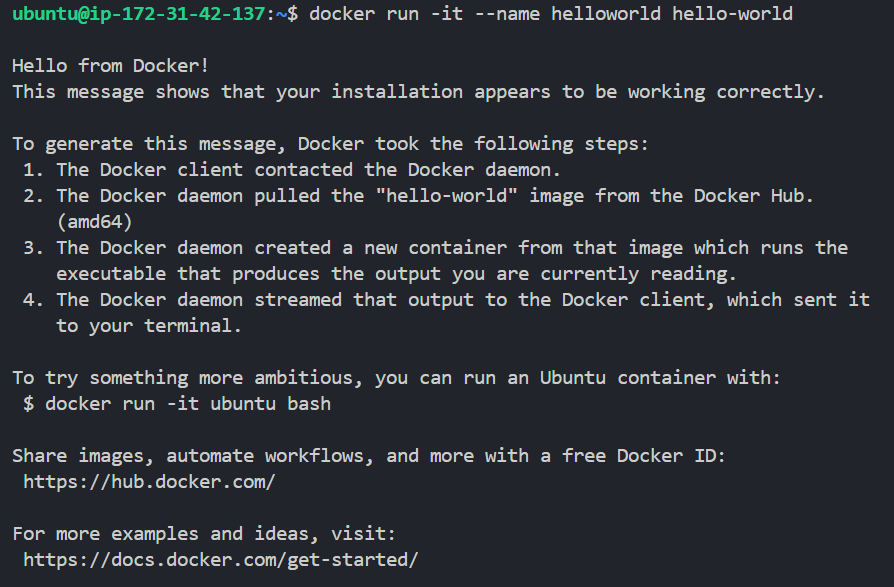

Task -3
1. Run an Nginx container and access it in your browser
-
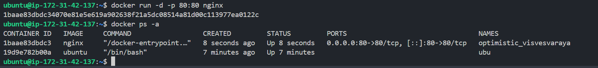
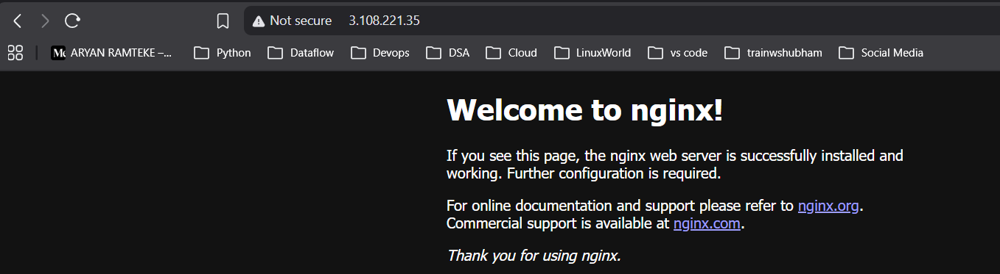

running cont-
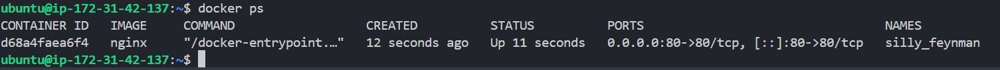

list all cont-
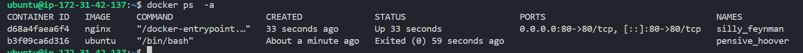

stop and remove cont-
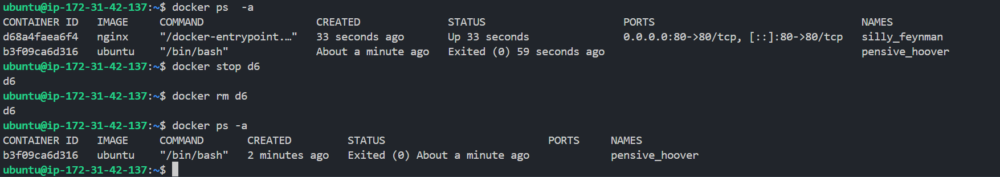

Task 4-

1.Run a container in detached mode — what's different?
- 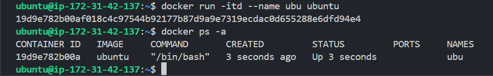
Container runs in background.

2. Give a container a custom name
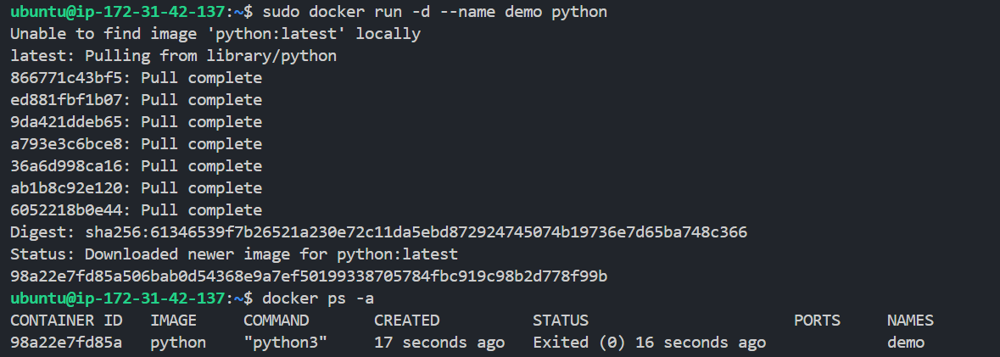

3. Map a port from the container to your host
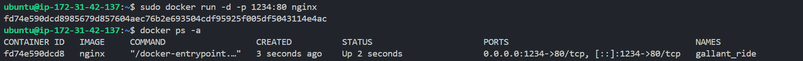

4. check logs of running container
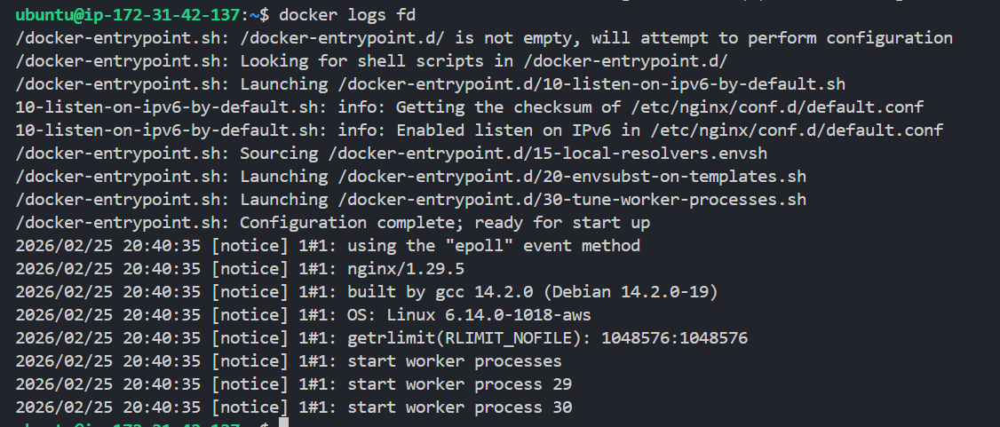

5. Run a command inside a running container
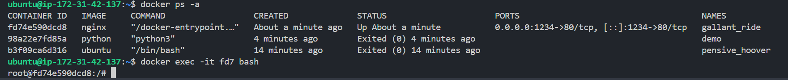