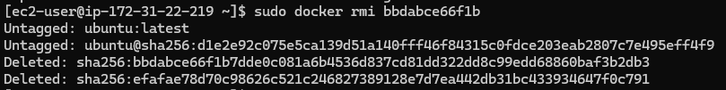
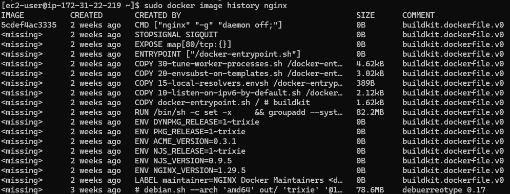

### Pull nginx, ubuntu and alpine and compare their sizes

### Inspect an image

### Remove an image

### sudo docker image history nginx

### What are layers and why does docker use them?

Docker layers are immutable, read-only file system changes created by each instruction in a Dockerfile, stacked up on each other to form an image. Docker uses them across containers to optimize storage, fast builds by caching them and enable lightweight containers.