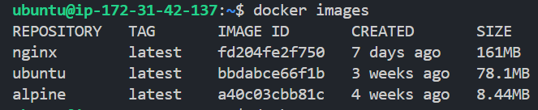
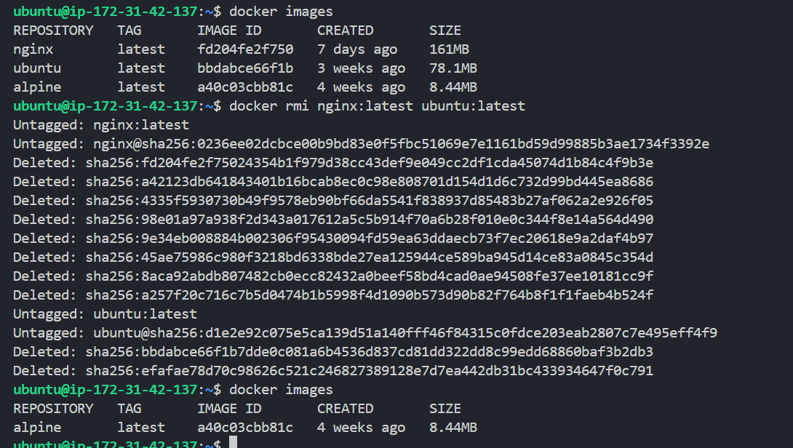

### Task 1: Docker Images
1. Pull the `nginx`, `ubuntu`, and `alpine` images from Docker Hub
2. 2. List all images on your machine — note the sizes
->



3. Compare `ubuntu` vs `alpine` — why is one much smaller?
-> alpine is smaller

4. Inspect an image — what information can you see?
->
It shows images id, tags, exposed ports, env variables, entrypoint and cmd entry, OS info.

5. Remove an image you no longer need.
-> docker rmi img_id/image_name


### Task 2: Image Layers
1. Run `docker image history nginx` — what do you see?
-> I can see image ids with their respective commands.

2. Each line is a **layer**. Note how some layers show sizes and some show 0B

3. Write in your notes: What are layers and why does Docker use them?
->
done.

### Task 3: Container Lifecycle
Practice the full lifecycle on one container:
1. **Create** a container (without starting it)
   ```bash
   docker create --name myalpine alpine
   ```
   This command creates a container named `myalpine` from the `alpine` image; it will be listed as `Created` in `docker ps -a`.
2. **Start** the container
   ```bash
   docker start myalpine
   ```
   After starting, `docker ps` will show the container running.
3. **Pause** it and check status
4. **Unpause** it
5. **Stop** it
6. **Restart** it
7. **Kill** it
8. **Remove** it

Check `docker ps -a` after each step — observe the state changes.