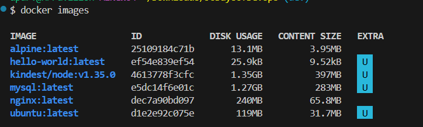
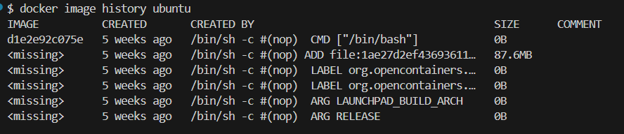
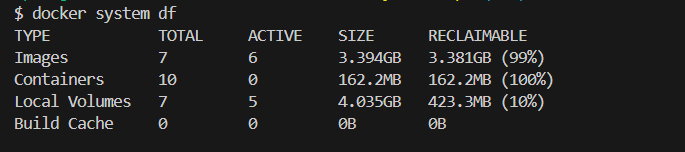

# Day 30 – Docker Images & Container Lifecycle
## Task 1: Docker Images
1. Pull the nginx, ubuntu, and alpine images from Docker Hub
`docker pull nginx` , `docker pull ubuntu` , `docker pull alpine`
2. List all images on your machine — note the sizes
`docker images`
3. Ubuntu vs Alpine — Why Size Difference?
- Ubuntu is a full linux distro which includes package managers, system utilities, libraries. Size 119MB disk usage and whereas alpine is a minimal linux distro with 13.1MB. Its a lightweight tool , musl libc instead of glibc

4. Inspect an image - `docker image inspect ubuntu` - you will see detailed JSON o/p:
Important Fields:
Id → Unique image ID
RepoTags → Image name & tag
Created → When image was built
Size → Image size
Architecture → (amd64, arm, etc.)
OS → Linux
Layers → Image layers
Env variables → Default environment settings
Cmd → Default command when container runs
👉 This helps you understand:

How the image is built
What runs inside it

5. Remove an Image - `docker rmi ubuntu`
- if container is using it then force remove - `docker rmi -f ubuntu`

## Task 2: Image Layers
1. Run docker image history nginx — what do you see?


2. Each line is a layer. Note how some layers show sizes and some show 0B
- Each row is a layer, Layers with soze > 0 , these layers add actual data. Eg: installing packages, copying lines. These increases image size.
- layers with size 0B are metadata layers. Eg: CMD, ENV, EXPOSE. They dont add files , just instructions
3. What Are Docker Layers?
- Docker images are built using multiple read-only layers stacked on top of each other. Each layers represents -
1. A change
2. A command in Dockerfile
- Example (Simple Dockerfile)
```
FROM ubuntu
RUN apt-get update
RUN apt-get install nginx
COPY . /app
CMD ["nginx"]
```
Creates layers like:Base OS (ubuntu), Update packages, Install nginx, Copy files, Start command

5. Why Does Docker Use Layers?
- Faster builds - If a layer doesn’t change → Docker reuses it. Eg: If only code changes → OS + dependencies are reused
- Storage Efficiency - Layers are shared between images - Eg: ubuntu used by multiple images → stored once
- faster Downloads - Only new/changed layers are pulled
- Version Controls - Easy to track changes between image versions
```
Docker images are built using a layered architecture where each layer represents a change made by a Dockerfile instruction. Layers are read-only and stacked on top of each other to form the final image.

Docker uses layers to enable caching, reduce storage usage, speed up builds, and allow reuse of common components across multiple images.
```
## Task 3: Container Lifecycle
- Practice the full lifecycle on one container:
1. Create a Container (Without Starting) - `docker create --name mynginx nginx` - only create will not run
2. Start the Container - `docker start mynginx`
3. Pause the Container - `docker pause mynginx`
4. Unpause the Container -`docker unpause mynginx`
5. Stop the Container - `docker stop mynginx`
6. Restart the Container - `docker restart mynginx`
7. Kill the Container - `docker kill mynginx`
8. Remove the Container - `docker rm mynginx`

## Task 4: Working with Running Containers
1. Run Nginx in Detached Mode - `docker run -d --name mynginx -p 8080:80 nginx`
2. View logs - `docker logs mynginx` - It willshow Access logs, Errors, Startup logs
3. View Real-Time Logs (Follow Mode) - `docker logs -f mynginx` - Live requests will appear as you refresh browser
4. Exec into the Container (Interactive Mode) - `docker exec -it mynginx bash`
5. Run Single Command (Without Entering Container) - `docker exec mynginx ls /usr/share/nginx/html`
6. Inspect the Container - `docker inspect mynginx`
```
Running a container in detached mode allows it to run in the background. Logs can be viewed using docker logs, and real-time logs with the -f flag. The docker exec command is used to interact with a running container or execute commands inside it. The docker inspect command provides detailed metadata including IP address, port mappings, and mounted volumes.
```
## ask 5: Cleanup
1. 1. Stop All Running Containers (One Command) - `docker stop $(docker ps -q)`
- docker ps -q → gets IDs of running containers
- docker stop → stops all of them
2. Remove All Stopped Containers - `docker container prune`
- Alternative (force, no prompt): `docker container prune -f`
3. Remove Unused Images - `docker image prune`
- Remove ALL unused images (more aggressive): `docker image prune -a`
4. Check Docker Disk Usage - `docker system df`



