---
## Task 1: Install & Verify
---

- Check if Docker Compose is available on your machine

```bash
docker-compose --version
```

- Verify the version: 


---
Task 2: Your First Compose File
---

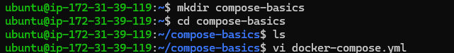

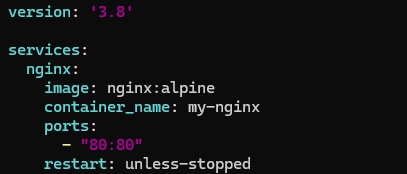

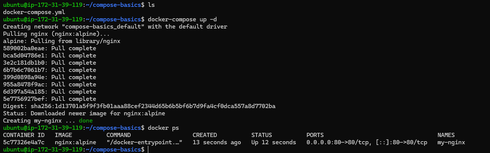


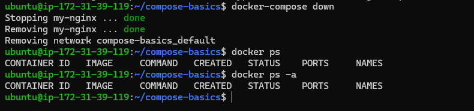

After performing above mentioned steps in this task i came to know that **docker-compose up** creates the container from docker-compose.yml file and also hosts it on the mentioned port in yml, we do not require explicit mapping in the command as we do it during creating / running a container from an image, and **docker-compose down** stops and removes the comtainer in a single command.

---
## Task 3: Two-Container Setup
---


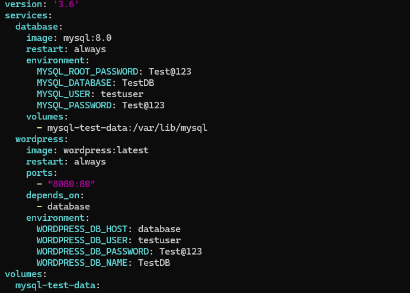

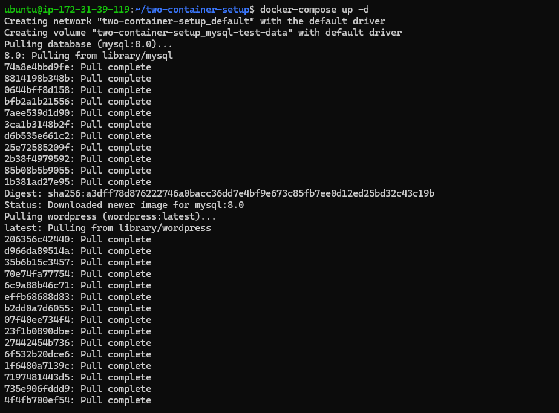

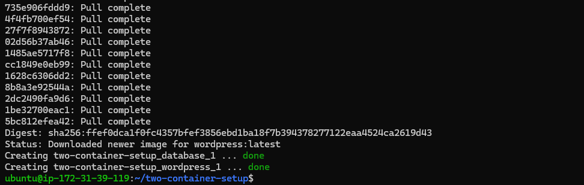


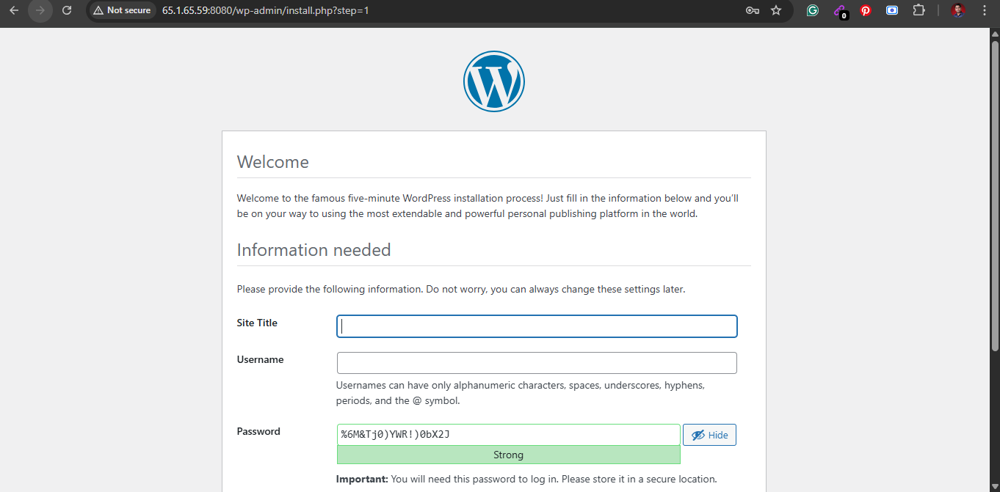

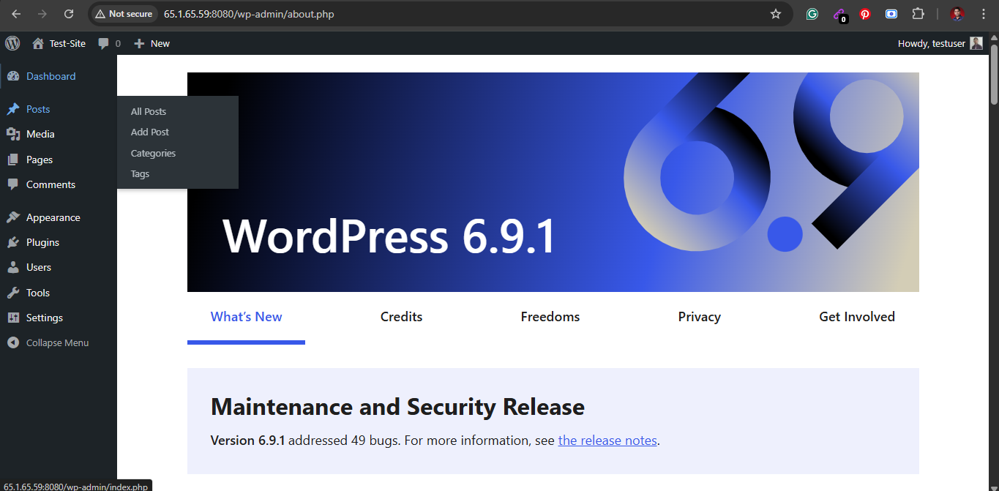

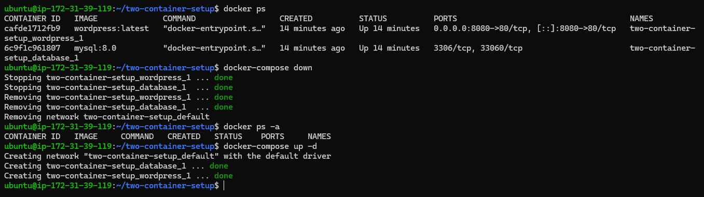


Wordpress data still persisted as after my first setup i did not require to setup the wordpress again after i executed docker-compose down and docker-compose up -d, i just had to login into the wordpress using the credentials which i had setup for the first time, this means that the data of the wordpress is stored in the mysql database and it is being persisted

If we use -v while executing docker-compose, it deletes/removes the volume as well due to which data also gets deleted hence you need to setup the wordpress again

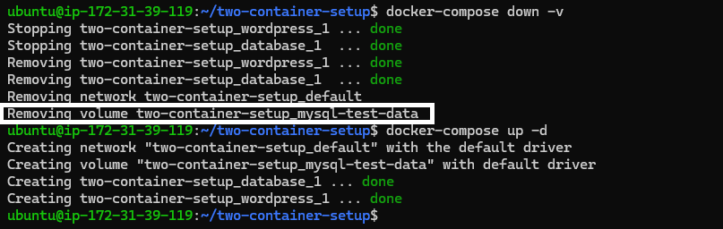


---

## Task 4: Compose Commands

1. Start services in detached mode

```bash
docker-compose up -d
```

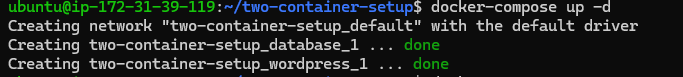

2. View running services

```bash
docker-compose ps
```

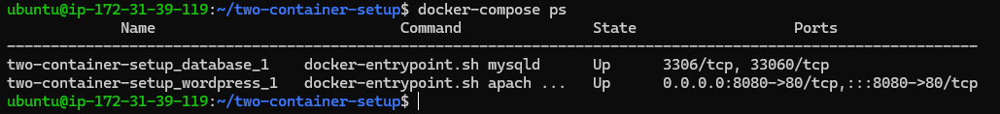

3. View logs of all services

```bash
docker-compose logs -f
```


4. View logs of a specific service

```bash
docker-compose logs $service_name
```

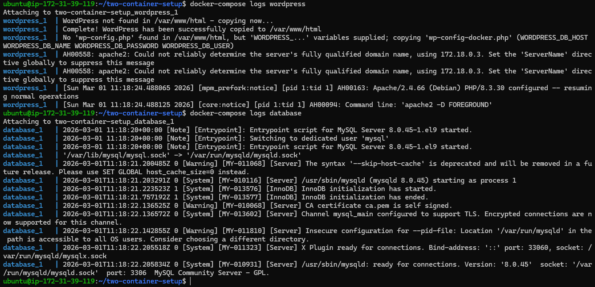

5. Stop services without removing

```bash
docker-compose stop
```

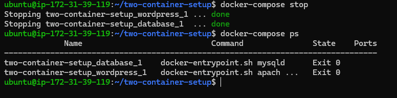

6. Remove everything (containers, networks)

```bash
docker-compose down
docker-compose ps
docker volume ls
```

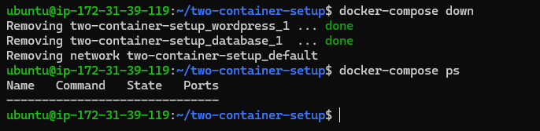

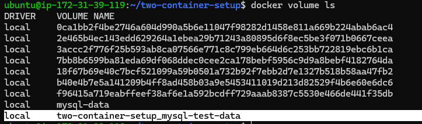

7. Rebuild images if you make a change

```bash
docker-compose up -d --build
```

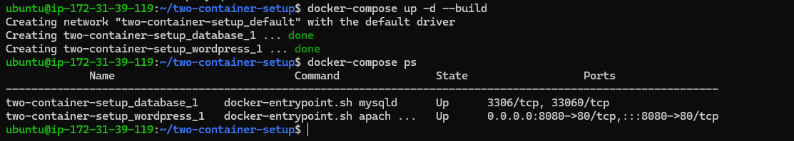

---
## Task 5: Environment Variables

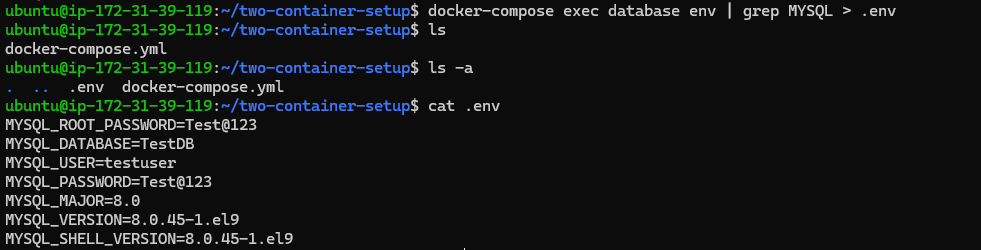

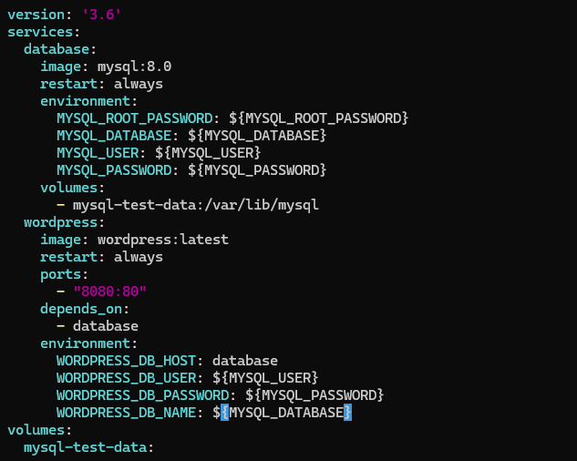

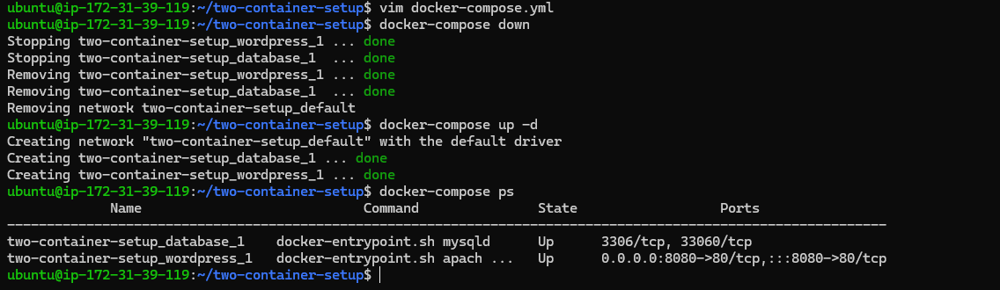

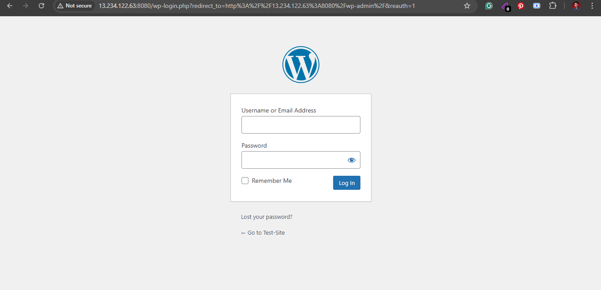
