---
# Multi-Stage Builds & Docker Hub
---

---

## Task 1: The Problem with Large Images

---

- Write a simple java app

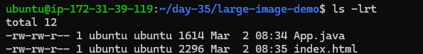

---

- Create a Dockerfile that builds and runs it in a single stage

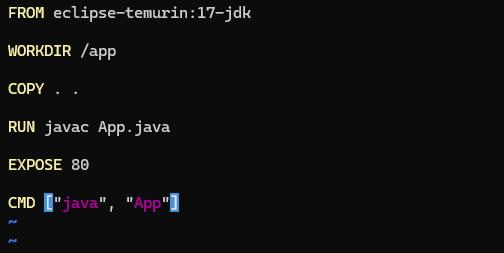

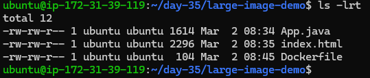

---

- Build the image and check its size

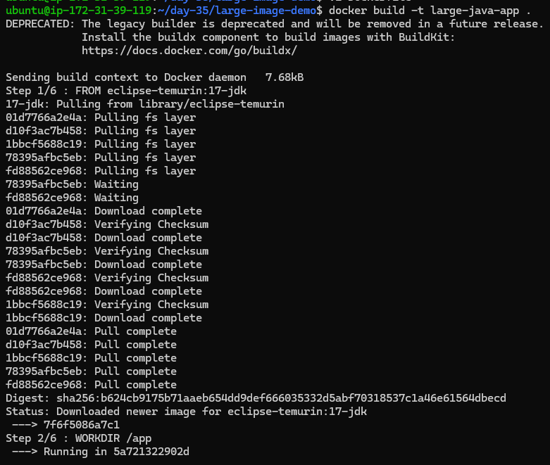

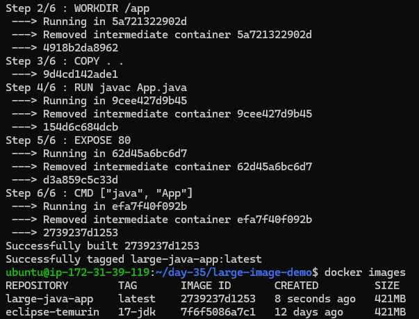

Size of the image 1 is 421 MB

---

## Task 2: Multi-Stage Build

---

- Rewrite the Dockerfile using multi-stage build:

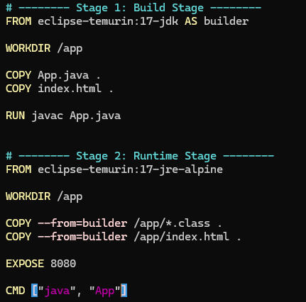

---

 - Build the image and check its size again

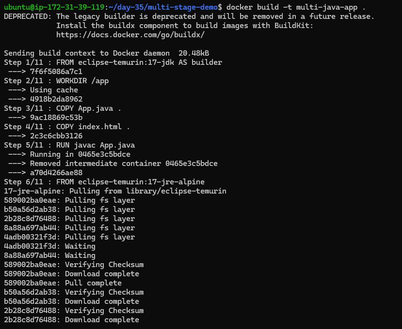

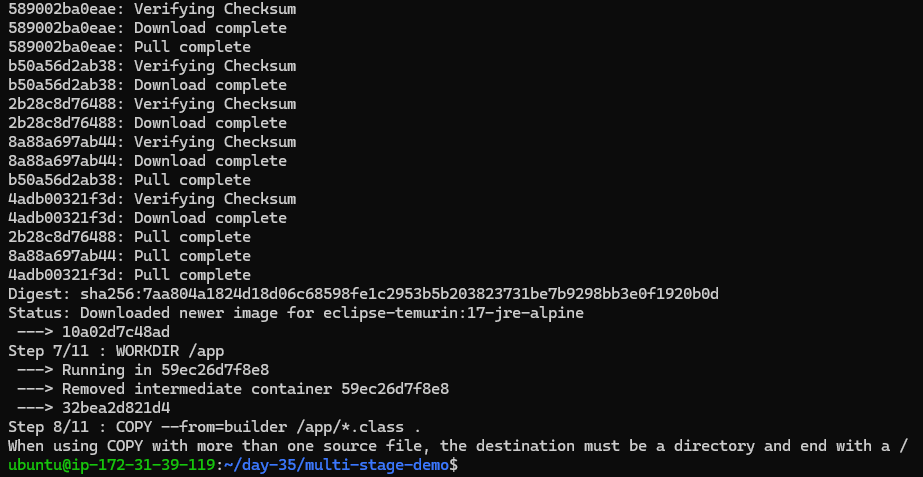

---

- Compare the two sizes

Earlier image size was 421 MB and now its 183 MB

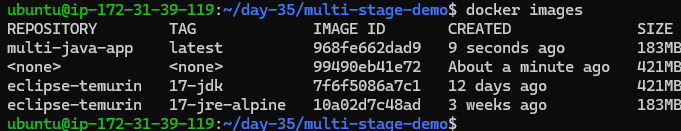

---

## Task 3: Push to Docker Hub

---

- Login to Docker Hub from your terminal

Use below command to login using your terminal

```bash
docker login
```

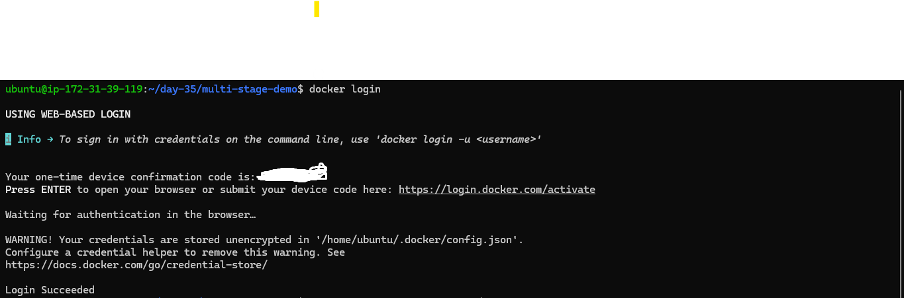

---

- Tag your image properly

Use below command to tag your image

```bash
docker tag multi-java-app:latest shivkumarkonnuri/multi-java-app:latest
```

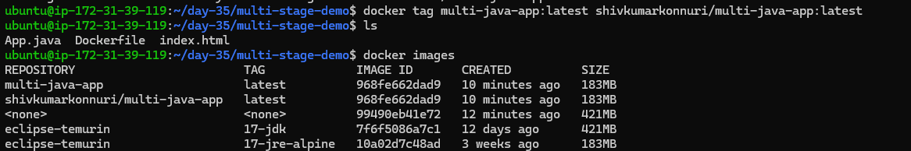

---

- Push it to Docker Hub

Use below command to push it to Docker Hub

```bash
docker push shivkumarkonnuri/multi-java-app:latest
```

---
- Pull the same image from Docker Hub

Use the below command to pull the image from the Docker Hub

```bash
docker pull shivkumarkonnuri/multi-java-app:latest
```

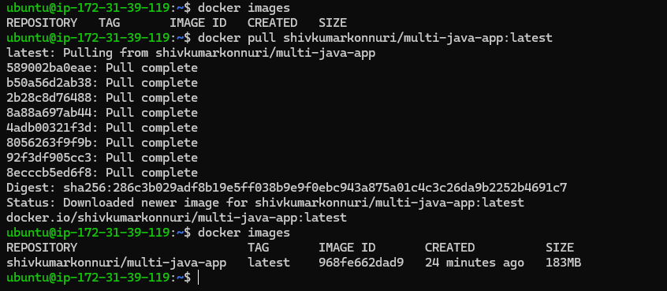

---

#@ 🐳 Task 4 – Docker Hub Repository Notes

### 📌 Objective
Understand how Docker Hub repositories, descriptions, tags, and versioning work.

---

### 🔹 1️⃣ Verified Pushed Image on Docker Hub

- Logged into Docker Hub
- Opened repository: `shivkumarkonnuri/multi-java-app`
- Confirmed:
  - Image is available
  - `latest` tag exists
  - Image size is visible
  - Last pushed timestamp is shown

---

### 🔹 2️⃣ Added Repository Description

Updated repository description to explain:
- Multi-stage Java application
- Image size optimization (421MB → 183MB)
- Purpose of the project (DevOps practice)

#### 📌 Why Description Matters
- Improves portfolio visibility
- Helps recruiters understand the project
- Documents purpose and implementation

---

### 🔹 3️⃣ Explored Tags Tab (Versioning Concept)

Observed:
- `latest`
- `v1`

#### 🧠 Understanding Tags

- Tags act as version labels
- Docker does NOT auto-version images
- `latest` is just a default label
- Multiple tags can point to the same image ID

Example:
- `latest`
- `v1`
- `v2`
- `1.0.0`

---

###🔹 4️⃣ Pulling Specific Tag vs Latest

#### Pull latest
```bash
docker pull shivkumarkonnuri/multi-java-app:latest
```

---

## Task 5 – Docker Image Best Practices (Complete Summary Notes)

---

### 🎯 Objective
Apply Docker image best practices to optimize an existing image by:
- Using a minimal base image
- Avoiding running containers as root
- Combining RUN commands to reduce layers
- Using specific image tags instead of `latest`
- Understanding container lifecycle behavior

---

### 1️⃣ Base Image Comparison

Compared two base images:

- `ubuntu:22.04` → 77.9 MB
- `alpine:3.19` → 7.4 MB

Observation:
- Alpine is ~10x smaller than Ubuntu.
- Smaller base images result in:
  - Faster image pulls (important in CI/CD)
  - Less storage usage
  - Reduced attack surface
  - Faster container startup

Conclusion:
Always prefer minimal base images like Alpine when possible.

---

### 2️⃣ Initial (Bad) Dockerfile Approach

Used:
- Base image: `ubuntu:22.04`
- Installed nginx using `apt`
- Multiple separate RUN instructions
- Container running as root

Issues:
- Heavy base image
- Unnecessary packages installed
- More image layers
- Larger attack surface
- Less secure

Final Image Size:
207 MB ❌

This showed how quickly image size increases when using full OS images.

---

### 3️⃣ Optimization Improvements

### ✅ Used Minimal Base Image

Switched to:
`nginx:1.25-alpine`

Benefits:
- Already includes nginx
- No need for apt install
- Much smaller size

---

### ✅ Used Specific Tag (Not latest)

Instead of:
`nginx:latest`

Used:
`nginx:1.25-alpine`

Reason:
- Ensures reproducibility
- Avoids unexpected breaking changes
- Stable builds in CI/CD

---

### ✅ Combined RUN Commands

Instead of multiple RUN instructions:
- Combined commands using `&&`
- Reduced number of layers
- Improved build efficiency

Important:
Reducing layers improves caching and image structure, though size reduction may not always be significant.

---

### ✅ Avoided Running as Root

Created non-root user:
- Added group
- Added user
- Switched using USER instruction

Why:
- Running as root increases security risks
- Best practice in production is least privilege

---

### ✅ Used COPY --chown

Instead of:
- Copying file
- Then running separate `chown` command

Used:
`COPY --chown=user:group`

Benefit:
- Avoided extra RUN layer
- Cleaner Dockerfile
- More optimized build

---

### 4️⃣ Image Size Improvement

Before Optimization:
207 MB

After Optimization:
48.3 MB

Reduction:
~160 MB improvement

This demonstrates the impact of base image choice and proper Dockerfile practices.

---

### 5️⃣ Real-World Issue Faced

When forcing nginx to run as non-root:

Error:
Permission denied for `/var/cache/nginx/client_temp`

Reason:
- Official nginx image expects root at startup
- It internally drops privileges
- Forcing USER manually broke permissions

Lesson:
Not all official images are designed to start directly as non-root.

---

### 6️⃣ Production-Grade Solution

Used:
`nginxinc/nginx-unprivileged:1.25-alpine`

Benefits:
- Designed to run as non-root
- Proper permissions pre-configured
- Runs on port 8080
- Secure and production-ready

Lesson:
Use purpose-built secure images instead of manually modifying official ones.

---

### 7️⃣ Important Concept Learned – Container Lifecycle

Key Rule:
Docker monitors PID 1 (main process).

If PID 1 exits:
→ Container stops

Detach mode (`-d`) only runs container in background.
It does NOT keep container alive.

For services like nginx:
Must run in foreground using:

`nginx -g "daemon off;"`

If a process daemonizes and exits:
Container stops immediately.

---

### 8️⃣ CMD and Base Image Inheritance

If a Dockerfile does NOT define CMD:
- It inherits CMD from base image.

Official nginx images already include:
`CMD ["nginx", "-g", "daemon off;"]`

That is why container runs even without defining CMD manually.

Lesson:
Docker images inherit:
- Filesystem
- Environment variables
- CMD
- ENTRYPOINT
- Metadata

---

### 🏆 Final Key Takeaways

- Always prefer minimal base images (Alpine).
- Pin specific versions instead of using `latest`.
- Combine RUN instructions to reduce layers.
- Use COPY --chown instead of separate chown layer.
- Avoid running containers as root.
- Understand how base image CMD inheritance works.
- Containers live and die based on PID 1.
- Detach mode does not control container lifecycle.
- Use unprivileged images for production security.

---

🔥 Result:
Successfully built a secure, optimized, production-ready Docker image following best practices and understood real-world container behavior.

---
