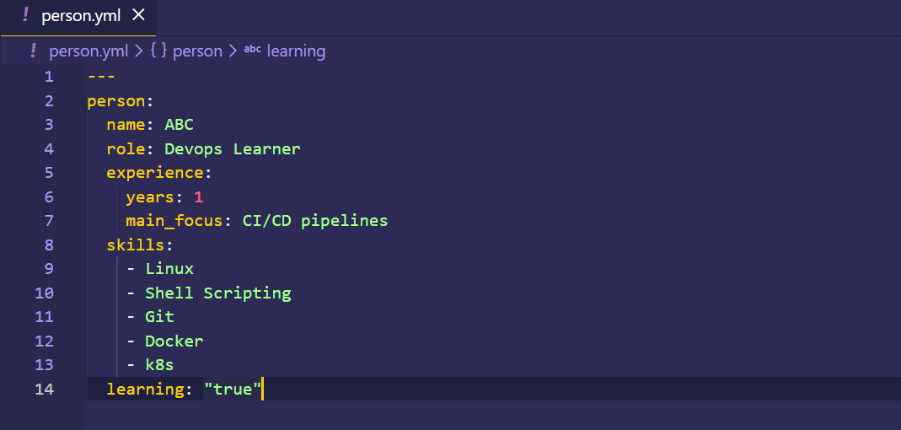
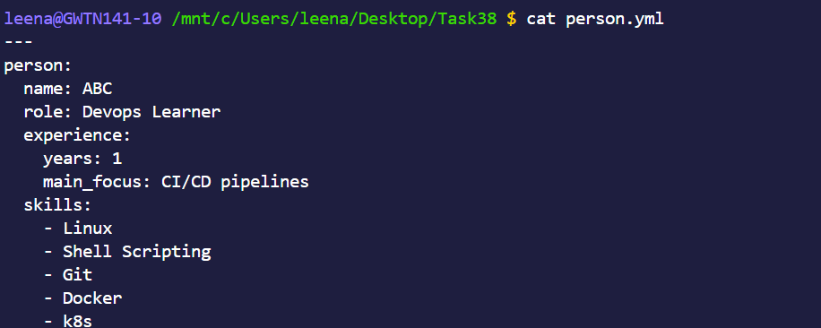
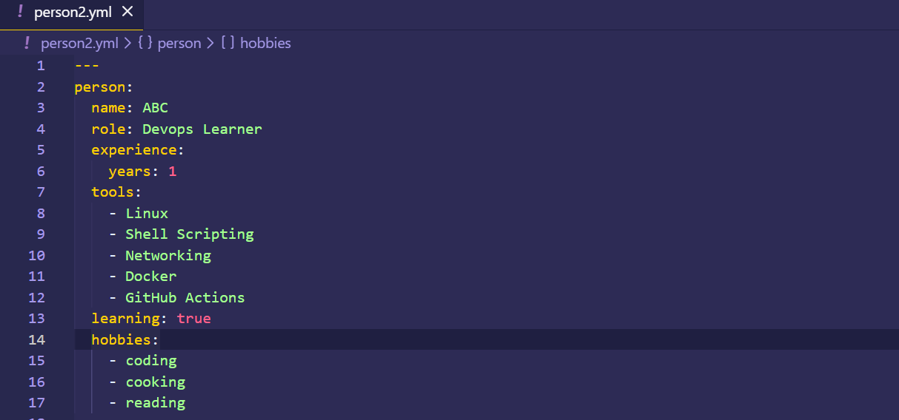
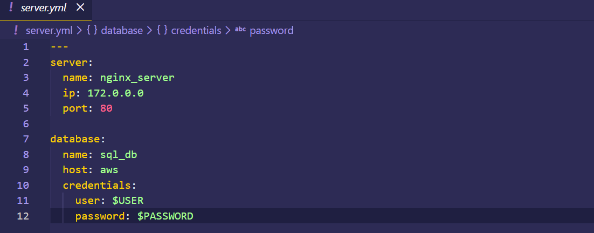
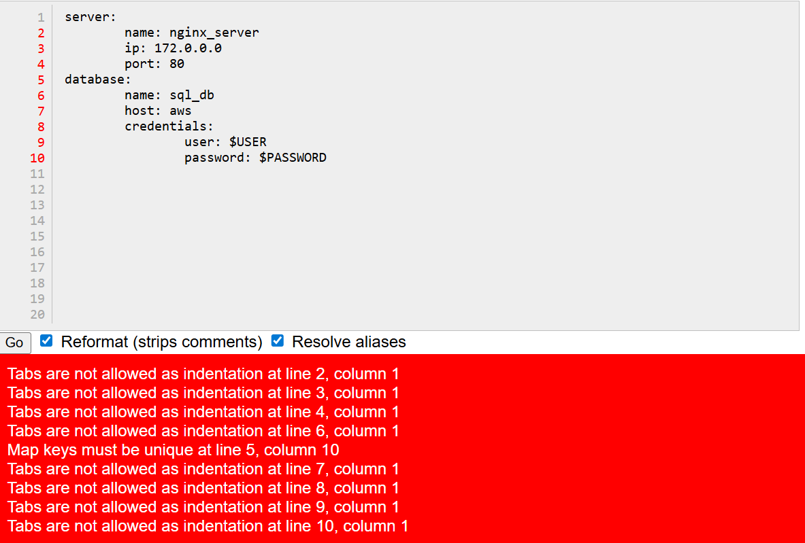
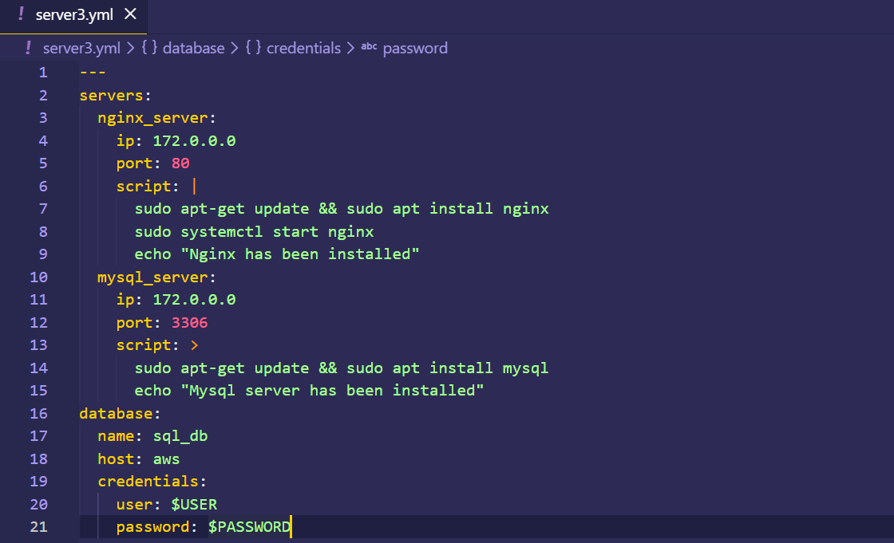
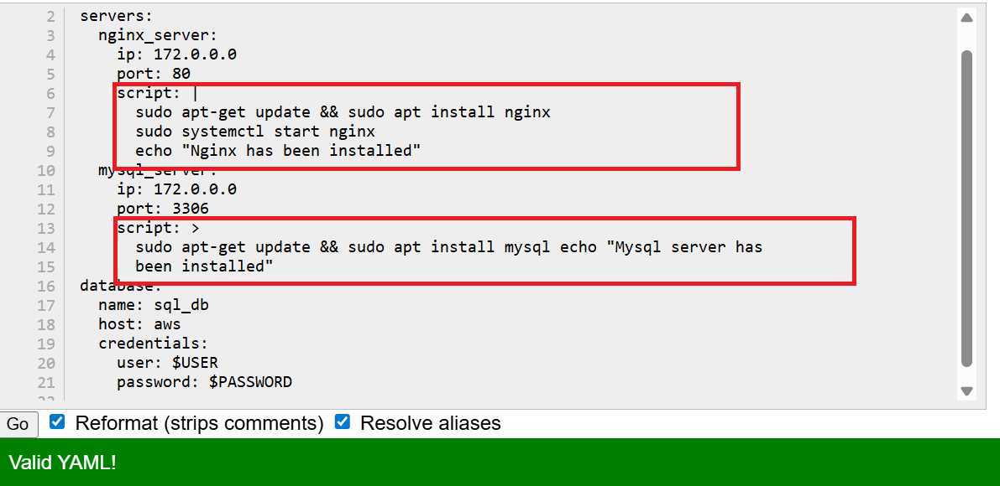

### Day 38 – YAML Basics
------
#### Task 1: Key-Value Pairs
Create person.yaml that describes yourself with:
name
role
experience_years
learning (a boolean)
Verify: Run cat person.yaml — does it look clean? No tabs?

>>**[ Script](Scripts/person.sh)**

#### Verify: Run cat person.yaml — does it look clean? No tabs?

#### Task 2: Lists
Add to person.yaml:

tools — a list of 5 DevOps tools you know or are learning
hobbies — a list using the inline format [item1, item2]

>>**[ Script](Scripts/person2.sh)**

Write in your notes: What are the two ways to write a list in YAML?

**Answer:**
There are two ways to declare the arrays in yml files **(1)** Block Style
- Each item starts with a - on a new line.
- Very readable
- Best for long lists
- Most commonly used in DevOps (Docker, Kubernetes, Ansible) 

**(2)** Inline Style
- All items are written on one line inside square brackets.
- Compact
- Good for short lists
- Less readable for long lists

#### Task 3: Nested Objects
Create server.yaml that describes a server:

server with nested keys: name, ip, port
database with nested keys: host, name, credentials (nested further: user, password)

>>**[ Script](Scripts/server.sh)**

Verify: Try adding a tab instead of spaces — what happens when you validate it?

#### Task 4: Multi-line Strings
In server.yaml, add a startup_script field using:

The | block style (preserves newlines)
The > fold style (folds into one line)

> The above image shows how yamllint gives output for **|** and **>**.

>>**[ Script](Scripts/server3.sh)**

Write in your notes: When would you use | vs >?

**Answer:**
**(1️)** **|** (Literal Block Style): Use | when line breaks must be preserved exactly as written.
Best for:
- Shell scripts
- Configuration files
- Code blocks
- Content where formatting matters
**(2)** **>**  (Folded Block Style):Use > when you want multiple lines to be combined into a single line (newlines become spaces).
 Best for:
- Long descriptions
- Paragraph text
- Notes
- Messages

#### Task 5: Validate Your YAML
Install yamllint or use an online validator
Validate both your YAML files
Intentionally break the indentation — what error do you get?
Fix it and validate again

#### Task 6: Spot the Difference
Read both blocks and write what's wrong with the second one:

**Block 1** - correct
name: devops
tools:
  - docker
  - kubernetes
**Block 2** - broken
name: devops
tools:
- docker
  - kubernetes

**Answer:**
**Why Block1 is correct:**
- tools: is a key.
- The list items (- docker, - kubernetes) are indented under tools.
- Both list items are aligned at the same level.
- Indentation is consistent.

**Why Block2 is incorrect:**

- docker is not indented under tools.

It starts at the same level as name and tools.

That means it is treated as a top-level list item, not inside tools.

- kubernetes is indented more than - docker.

YAML expects list items at the same level to have the same indentation.

This inconsistent indentation breaks the structure.
