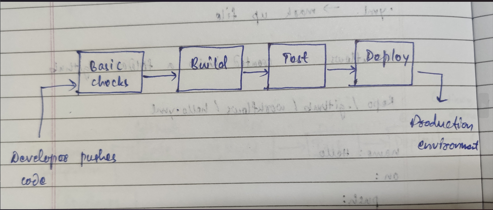

## Task 1

1. What can go wrong?

- A lot of file conflicts might occur which can break the production. 
- No track of history and who has changed which file
- Code might not work in production if not tested

2. What does "it works on my machine" mean and why is it a real problem?

When we run our code in our machine, the output we get is as expected and works fine but when deployed to production it doesn't which is the real problem.

3. How many times a day can a team safely deploy manually?

Safe manual deployment in a team tends to zero and never be safe.

## Task 2

1. Continuous integration: A practice where developers continuously merge their code to central repository triggering automated builds and tests.
Example- Developer pushing code using its shared branch which triggers a pipeline

2. Continuous delivery: A practice where code changes are automatically build, tested and prepared for deployment. It is deployed with least manual effort after earlier step completes
Example- 

3. Continuous deployment: A practice where code changes are automatically build, tested and deployed to production environment without any manual intervention.
Example- A e-commerce deploying a code fix after developer pushes code

## Task 3

Trigger: A predefined event or condition like code commit, pull request that automatically performs a number of actions like build, test and deploying code

Stage: A stage represents logical phase which contains multiple jobs like Build, Test, Deploy

Job: A job is a set of steps

Step: A set to individual tasks within a job

Runner: Virtual machines where job gets executed

Artifact: Output files produced by a job

## Task 4

## Task 5

FastAPI Repo: build-docs.yml

- Push to master branch or a pull request triggers a pipeline
- It has 4 jobs - changes, langs, build-docs, docs-all-green
- Looks like this is where docs of FastAPI that we get by default are designed here and modified whenever required 