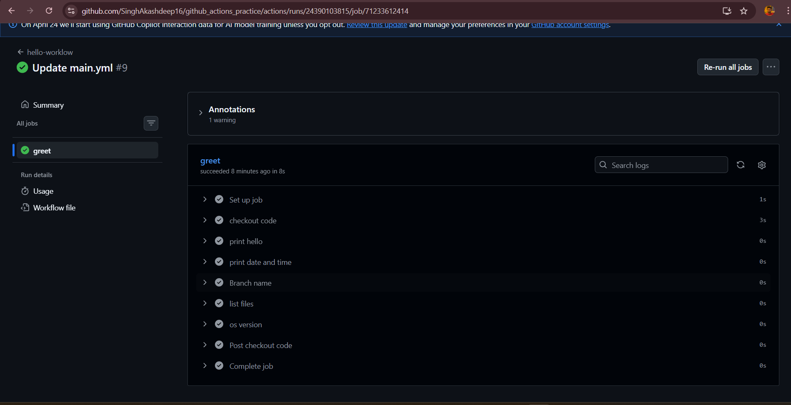

# Day 40 – My First GitHub Actions Workflow

## What I Did
Today I wrote my first GitHub Actions pipeline and watched it run live in the cloud. This is where CI/CD stopped being a concept and became real.

---

## Workflow File: `.github/workflows/hello.yml`

```yaml
name: "hello-workflow"

on:
  push:
    branches:
      - main

jobs:
  greet:
    runs-on: ubuntu-latest
    steps:
      - name: Checkout code
        uses: actions/checkout@v4

      - name: Print hello
        run: echo "Hello from GitHub Actions!"

      - name: Print date and time
        run: date

      - name: Branch name
        run: echo "Branch is ${{ github.ref_name }}"

      - name: List files
        run: ls

      - name: OS version
        run: uname -a
```

---

## What Each Key Does

| Key | What it does |
|-----|-------------|
| `on:` | Tells GitHub when to trigger the workflow — automatically on every push to main |
| `jobs:` | Defines what work needs to be done |
| `runs-on:` | The OS for the job — runs on a fresh Ubuntu VM in GitHub's cloud, not my machine |
| `steps:` | The list of things the job does one by one |
| `uses:` | Use a pre-built action someone already wrote, like `actions/checkout` to clone the repo onto the VM |
| `run:` | Run a shell command directly, like `echo` or `ls` |
| `name:` | A label for the step so you can read it easily in the Actions tab |

---

## What a Failed Pipeline Looks Like

When a step fails, the Actions tab shows a red cross ❌. Clicking into the job shows exactly which step failed and which line caused the error. Once fixed and pushed, the pipeline runs again and shows green ✅.

---

## GitHub Context Variables

GitHub provides built-in variables you can use in your workflow:

| Variable | Output |
|----------|--------|
| `${{ github.ref_name }}` | Branch name (e.g. `main`) |
| `${{ github.actor }}` |  GitHub username |
| `${{ github.repository }}` | `username/repo-name` |

These are accessed with `${{ }}` syntax — not `$` alone.

---

## Key Learnings

- GitHub Actions runs on a **fresh Linux VM in the cloud** — not my local Windows machine
- `uses:` and `run:` are different — one uses a pre-built action, one runs a shell command
- Every push triggers a new workflow run
- The Actions tab shows green ✅ or red ❌ per step
- Linux commands like `uname -a` and `ls` are used — not Windows/PowerShell commands

---

## Key Learnings

---
`#90DaysOfDevOps` `#DevOpsKaJosh` `#TrainWithShubham`
