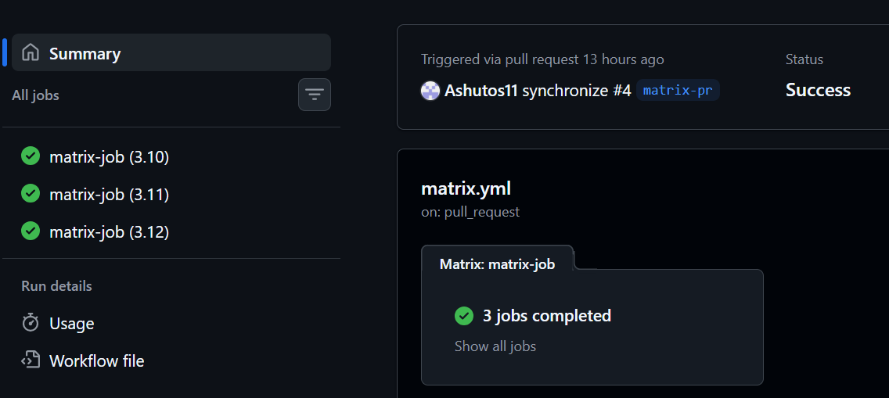
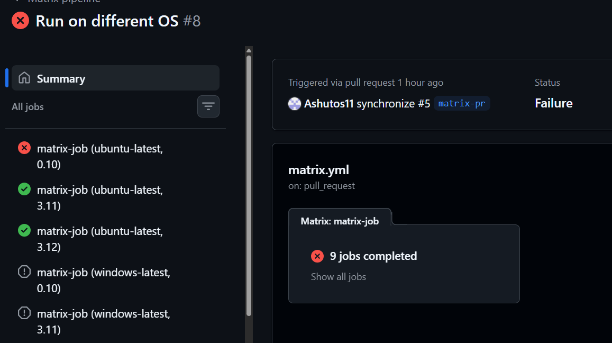

## Task 3

- on: Trigger pipeline on which event
- jobs: Set of units that needs to be performed
- runs-on: On which machine the job should run
- steps: Sets of actions to be performed
- uses: A reusable action or workflow to run as a part of a job or job itself
- run: Command you want to run
- name: Display the name of the action being performed

## Task 4

Observations:

- When os is only mentioned as ubuntu-latest and 3 python versions are mentioned, only 3 jobs run
- Whereas when 3 more OS are declared, total 9 jobs run, all python versions are insatlled for all machines

Successful run:

When fail-fast is set as true:

