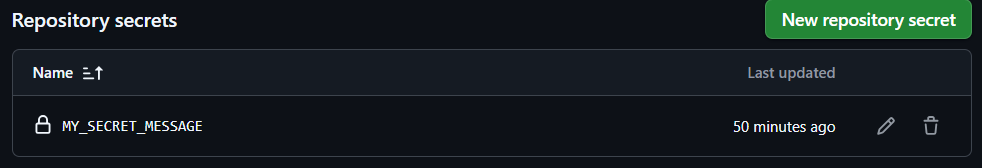
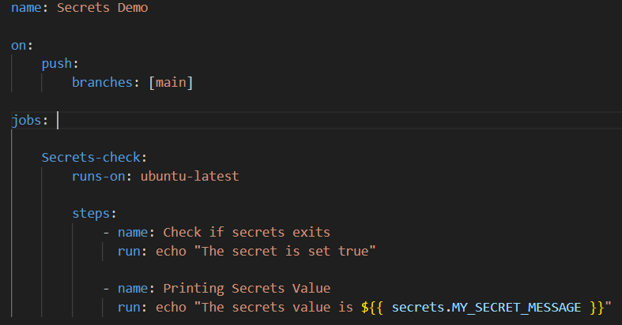
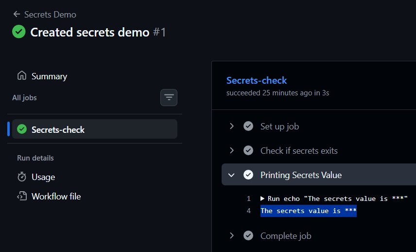
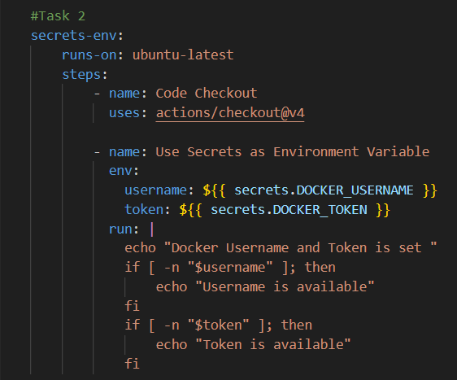
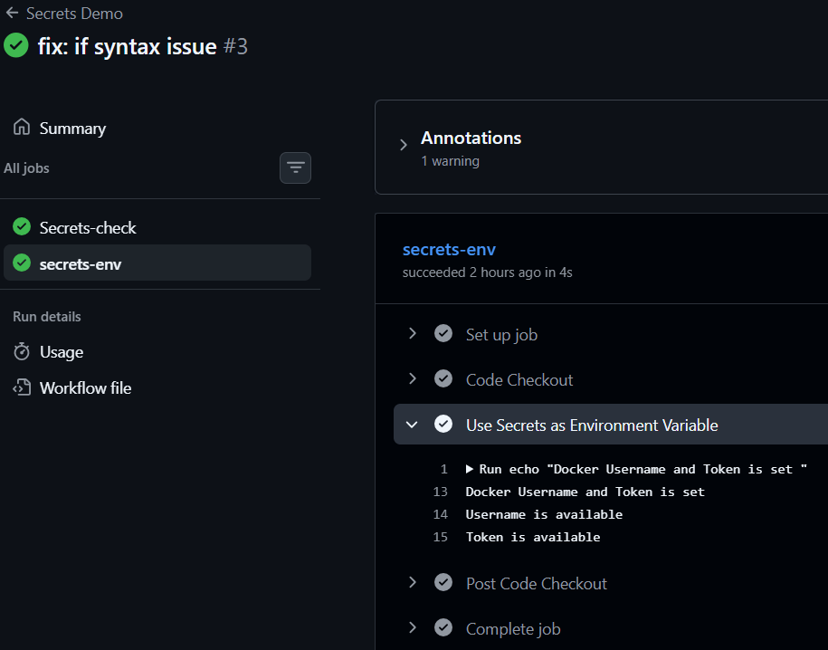
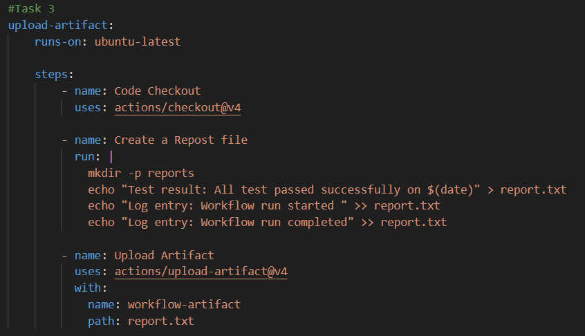
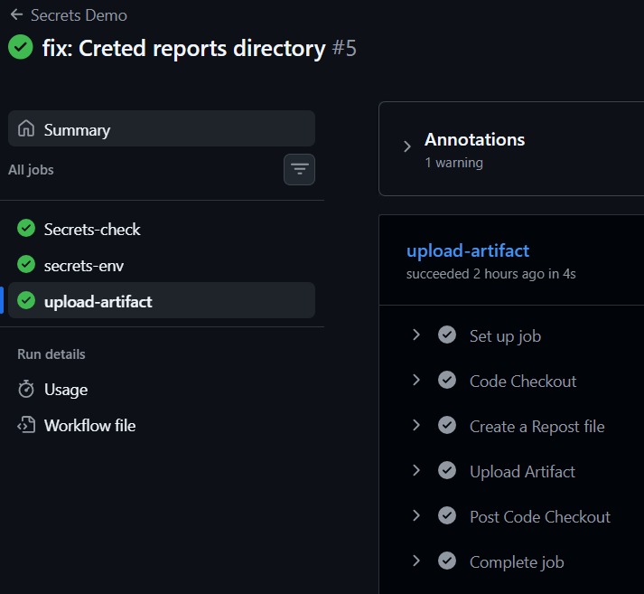
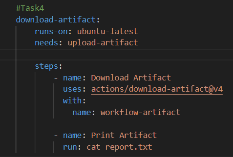
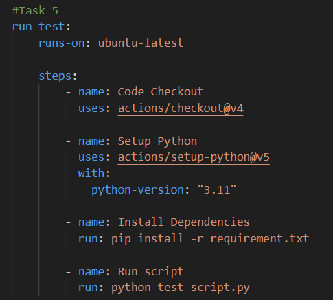
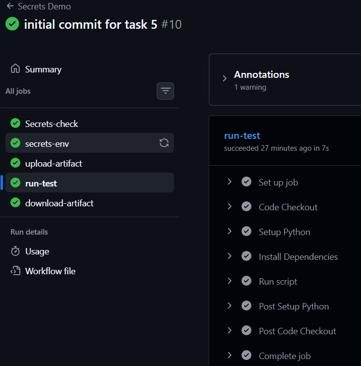

Task 1: GitHub Secrets
- Go to your repo → Settings → Secrets and Variables → Actions
- Create a secret called MY_SECRET_MESSAGE
  

- Create a workflow that reads it and prints: The secret is set: true (never print the actual value)
    

- Try to print ${{ secrets.MY_SECRET_MESSAGE }} directly — what does GitHub show?
  
  
- Write in your notes: Why should you never print secrets in CI logs?

  If a secret is printed in logs using ${{ secrets.SECRET_NAME }}, GitHub automatically masks the value and replaces it with *** to prevent exposure.
  Secrets should never be printed because:
  - Logs are visible to repository collaborators
  - Logs may be stored for a long time
  - Attackers could steal credentials
  - Secrets may contain sensitive data like:  API keys, Cloud credentials, Database passwords, Tokens

Task 2: Use Secrets as Environment Variables
- Pass a secret to a step as an environment variable
- Use it in a shell command without ever hardcoding it
- Add DOCKER_USERNAME and DOCKER_TOKEN as secrets (you'll need these on Day 45)
  
  

Task 3: Upload Artifacts
- Create a step that generates a file — e.g., a test report or a log file
- Use actions/upload-artifact to save it
  

- After the workflow runs, download the artifact from the Actions tab
  
  
Task 4: Download Artifacts Between Jobs
- Job 1: generate a file and upload it as an artifact
- Job 2: download the artifact from Job 1 and use it (print its contents)

  

- Write in your notes: When would you use artifacts in a real pipeline?
  Artifacts are used when you need to pass files between jobs or store outputs.

Task 5: Run Real Tests in CI
- Take any script from your earlier days (Python or Shell) and run it in CI:
- Add your script to the github-actions-practice repo
- Write a workflow that:
  - Checks out the code
  - Installs any dependencies needed
  - Runs the script
- Fails the pipeline if the script exits with a non-zero code
- Intentionally break the script — verify the pipeline goes red
- Fix it — verify it goes green again

  
  
