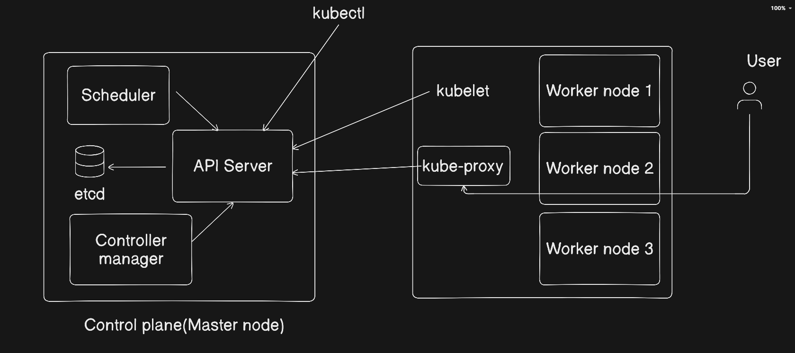
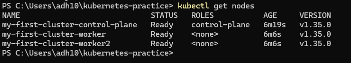
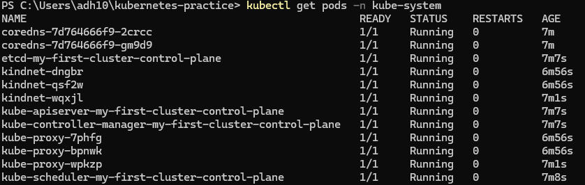

1. Why was Kubernetes created? What problem does it solve that Docker alone cannot?
A. Kubernetes was created to scale containerized applications, docker alone cannot solve this problem.

2. Who created Kubernetes and what was it inspired by?
A. Google created Kubernetes. It was inspired by Google's internal cluster management system called Borg.

3. What does the name Kubernetes mean?
A. Kubernetes is a greek word which means "Captain" in English. As captain is responsible for safe journey of containers in the sea, Kubernetes is responsible for docker containers to run smoothly. 

4. What is a kubeconfig? Where is it stored on your machine?

It is a yml formatted configuration file used by kubectl and other clients to authenticate and connect to Kubernetes cluster. In windows, it is located at C:\Users\adh10\.kube\config

Kubernetes architecture diagram:

5. What are you using kind or minikube?

A. I am using kind as it runs Kubernetes in Docker. It is lightweight and fast in nature which makes it convenient to work.

kubectl get nodes

kubectl get pods -n kube-system

coredns: It servers as core service discovery mechanism, mapping Kubernetes service names to IP addresses, while also handling external DNS lookups and caching.

etcd-my-first-cluster-control-plane: It is serves as primary database for Kubernetes control plane, holding all cluster state, configuration data and metadata

kube-apiserver-my-first-cluster-control-plane: It is the frontend of Kubernetes control plane and the primary interface through which all users and components communicate with cluster

kube-controller-my-first-cluster-control-plane: Runs controller processes such as node, job and replication controllers to maintain the cluster's desired state

kube-scheduler-my-first-cluster-control-plane: Responsible for assigining newly created pods to healthy and available nodes within the cluster

kube-proxy-2qwerw: Network component which runs on every node of a cluster, enabling service to pod communication. Maintains the network rules that allow network communication to pods inside or outside cluster.

kindnet-qwyio: It is a Container Network Interface(CNI) plugin. It acts as default networking solution for kind clusters, facilitating communication between pods across different container nodes.
